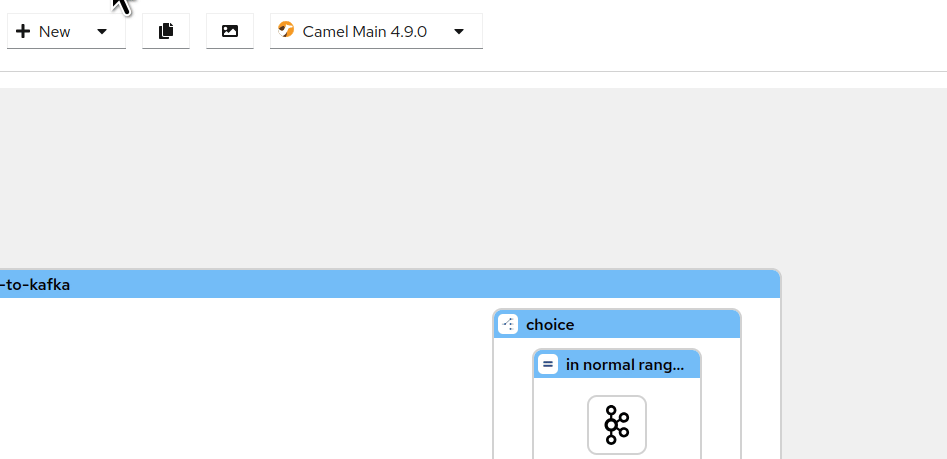

## What's new?

It has been over 2 months since the Kaoto 2.2 release and we are excited to provide you now with the new Kaoto 2.3 version. 
Please take a look below to learn about the exciting new things we added in this release.

## Features & Improvements

#### More Camel versions included by default
We have added more choices to the Camel version selector. Now you will be able to choose between the latest community release, the latest LTS community release as well as the Red Hat Build of Apache Camel releases.

#### Visual Data Mapping & Transformation Editor (Tech Preview available in VS Code)
This feature has been requested a lot and we are very happy to provide you with the first iteration of a fully new Data Mapping UI which enables you to do your mappings and transformations in a drag and drop way. In comparison to AtlasMap the new Kaoto DataMapper works based on XSLT and does not require a specific custom runtime component to work.  
This first iteration marks only the beginning of the Kaoto DataMapper story. There are still many more features and capabilities we want to add over the coming months.

#### New Action Toolbar
Our long term goal is to improve the usability in a way that users can reach most of the functionalities of Kaoto with the least amount of clicks and searching. Efficiency is key to make using Kaoto a fun experience for everyone. A first step in that direction is the new toolbar. In the long run we hope to make this the replacement for the right-click context menu.

In the default settings the toolbar will be visible when hovering over a step or group. However you can also change that behavior in the *Settings* dialog to be only visible when selecting a step or group.

#### Quick Action for appending and inserting new steps
Prototyping a new integration should be as easy and fast as possible in a visual designer. To get closer to that state we added a quick action at the end of each group in your integration which is visible as an **arrow** button. You can now easily append new steps to your integration by clicking that button. 

We also introduced an easier way to insert steps between existing ones. You can now just hover over the connection between two steps and this will reveal a **+** button you can use to insert a new step.

#### New Placeholders
Whenever there is a container step without any step contained we will now show you a placeholder labeled "*Add step*" to signal where you can add new steps.

#### New Action: Enable All
During the creation of your integration you may have disabled one or more steps for various purposes. Going through your integration now and manually enabling all the deactived steps can be a tedious task and this situation led to the addition of the new "Enable All" action. You can now reactivate all the disabled steps with a single click.

#### New Action: Show All
There is a new action available now which lets you quickly show or hide all of your routes.

#### Other Enhancements
* Improved visualization of routes
* Easily close the configuration panel by clicking on a free canvas space
* The description of a step will be expanded on selection
* Improved search function in the catalog
* Support for the Tokenizer EIP
* ...and many more little tweaks and fixes...

## Bug Fixes

For a full list of changes please refer to the [change log.](https://github.com/KaotoIO/kaoto/releases/tag/2.3.0)

## Let’s Build it Together

Let us know what you think by joining us in the [GitHub discussions](https://github.com/orgs/KaotoIO/discussions).
Do you have an idea how to improve Kaoto? Would you love to see a useful feature implemented or simply ask a question? Please [create an issue](https://github.com/KaotoIO/kaoto/issues/new/choose).

## A big shoutout to our amazing contributors
Thank you to everyone who made this release possible, whether by a code contribution, feedback, advocacy, or participating in an important discussion with us. ❤️

## Give it a try!

* Kaoto [quickstart](/docs/quickstart/).
* Kaoto is available as a [VS Code extension](https://marketplace.visualstudio.com/items?itemName=redhat.vscode-kaoto).
* Kaoto [showcase deployment](https://red.ht/kaoto).
