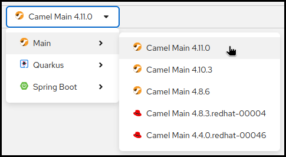

## What's new?

It has been a while since the last Kaoto release and we are excited to provide you now with the new Kaoto 2.5 version. 
Please take a look below to learn about the exciting new things we added to this release.

## Features & Improvements

#### Updated list of supported Camel versions
This version includes the latest Camel catalog version 4.11.0, which brings new components and features to enhance your integration capabilities, alongside the latest LTS version 4.10.3.

#### XML IO Support
Not everyone likes YAML and we are happy to help here and announce that Kaoto now supports the Camel XML IO DSL. 

#### Generate Markdown Documentation
Do you want to document your routes effortlessly? You can now export your integration flows with Kaoto as Markdown documents, including a visual representation of the flow in addition to the changed route parameters, making it easier to share and review routes.

#### DataMapper Enhancements
* Support adding multiple mappings on the collection target field
* UI polish for better drag-and-drop experience
* Update generated XSLT version to 3.0

#### New Kaoto Perspective in VS Code
The Kaoto VS Code extension has been reworked heavily and our goal was to provide you an extension that can work standalone and still provide you most of the features you need for your daily integration work. What does this mean?

* the _Extension Pack for Apache Camel_ is no longer required for Kaoto to work
* the introduction of a new Kaoto perspective (see the Kaoto icon on the VS Code side bar)
* the new perspective provides you with easy access to
  * an `Integrations` section providing easy access to your integration files and the contained routes as well as related actions (run, deploy, ...)
  * a `Deployments` section providing easy access to local running integrations and their statuses with easy to access actions (start, stop, pause, resume, log, ...)
  * a `Help & Feedback` section providing links to useful resources for your daily work

#### Configuration Form Enhancements
We’re introducing a new Kaoto Form, a redesigned form engine with improved field behavior, better keyboard navigation and filtering for dropdown fields, the possibility to wrap the values in a `RAW()` function call and a new `Clear` button to completely remove the field from the source code.

#### Filter Flows in the Flows List
You can now filter the flows in the flows list by name, making it easier to find specific routes in larger projects.

#### Dark Mode
For those who fancy a darker theme, Kaoto now supports dark mode in the VS Code extension. You can switch to dark mode in the settings.

#### DevSpaces Ready with Devfile Support
Kaoto now includes an OpenShift-compatible devfile.yaml, making it easier to develop Kaoto in OpenShift Dev Spaces or similar cloud-based workspaces.

#### Other Enhancements
* various usability improvements in the graphical editor
* added an "About" tab with information on the used Kaoto version
* ...and many more little tweaks and fixes...

## Bug Fixes

For a full list of changes please refer to the [change log.](https://github.com/KaotoIO/kaoto/releases/tag/2.5.0)

## Let’s Build it Together

Let us know what you think by joining us in the [GitHub discussions](https://github.com/orgs/KaotoIO/discussions).
Do you have an idea how to improve Kaoto? Would you love to see a useful feature implemented or simply ask a question? Please [create an issue](https://github.com/KaotoIO/kaoto/issues/new/choose).

## A big shoutout to our amazing contributors
Thank you to everyone who made this release possible, whether by a code contribution, feedback, advocacy, or participating in an important discussion with us. ❤️

## Give it a try!

* Kaoto [quickstart](/docs/quickstart/).
* Kaoto is available as a [VS Code extension](https://marketplace.visualstudio.com/items?itemName=redhat.vscode-kaoto).
* Kaoto [showcase deployment](https://red.ht/kaoto).
