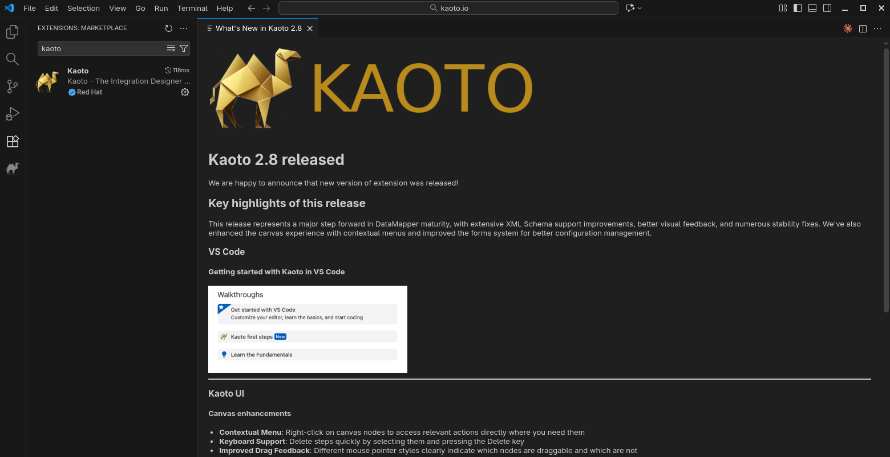

## What's new?

This release represents a major step forward in Data Mapper maturity, with extensive XML Schema support improvements, better visual feedback, and numerous stability fixes. We've also enhanced the canvas experience with contextual menus and improved the forms system for better configuration management.

## Features & Improvements

### Camel Catalog Version
This version includes:
* Camel main: 4.16.0
* Camel extensions for Quarkus: 3.29.0
* Camel Spring-boot: 4.14.1

### Data Mapper XML Schema Support Enhancements
Kaoto 2.8 brings improvements to XML Schema handling:

- **Advanced Schema Features**: Full support for `xs:extension`, `xs:restriction`, allowing you to work with sophisticated XML schemas
- **Field Type Visualization**: Field type icons now appear in the tree view, making it easier to identify data types at a glance

- **Occurrence Indicators**: Display of `minOccurs` and `maxOccurs` attributes helps you understand cardinality requirements directly in the UI

- **Improved XPath Handling**: Better support for relative xpath with parent (`..`) notation and `current()` function in expressions

- **Parameter Renaming**: Rename parameters directly within the DataMapper interface

- **Smart Deletion**: Warning prompts when deleting mappings with child mappings to prevent accidental data loss

### Canvas Enhancements
- **Contextual Menu**: Right-click on canvas nodes to access relevant actions directly where you need them


- **Keyboard Support**: Delete steps quickly by selecting them and pressing the `Delete` key
- **Improved Drag Feedback**: Different mouse pointer styles clearly indicate which nodes are draggable and which are not
 

### Forms and Configuration
- **Enum Field Support**: Improved component’s options when `enum` type is available

- **Beans EIP**: The beans EIP now shows a list of defined beans in the Camel route

- **JDBC component**: The JDBC now shows the `default` and `dataSource` options and offers a list of beans to pick a dataSource from

- **OnException Validation**: Enhanced validation for exception handling configurations

### What's New - Overview
Starting with Kaoto 2.8 we will inform our users with every update about the news in that specific version. You will get a `What's New` tab opened after the installation displaying an overview of the new features and bug fixes.

## Bug Fixes
- **URI Serialization**: Improved component parameter handling in XML URI serialization when no syntax is present
- **Route Ordering**: Fixed the order of `Intercept` elements to ensure correct processing sequence

For a full list of changes please refer to the [change log.](https://github.com/KaotoIO/kaoto/releases/tag/2.8.0)

## Let’s Build it Together

Let us know what you think by joining us in the [GitHub discussions](https://github.com/orgs/KaotoIO/discussions).
Do you have an idea how to improve Kaoto? Would you love to see a useful feature implemented or simply ask a question? Please [create an issue](https://github.com/KaotoIO/kaoto/issues/new/choose).

## A big shoutout to our amazing contributors
Thank you to everyone who made this release possible, whether by a code contribution, feedback, advocacy, or participating in an important discussion with us. ❤️

## Give it a try!

* Kaoto [quickstart](/docs/quickstart/).
* Kaoto is available as a [VS Code extension](https://marketplace.visualstudio.com/items?itemName=redhat.vscode-kaoto).
* Kaoto [showcase deployment](https://red.ht/kaoto).
