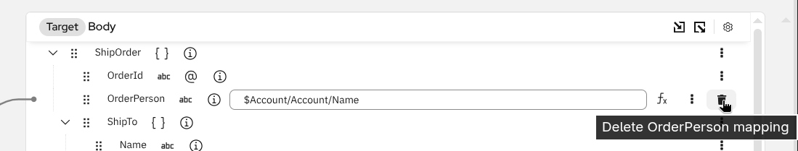

## Overview

Once you have schemas attached, you can create mappings between source and target fields. The DataMapper offers two primary methods: drag-and-drop for quick mappings and XPath expressions for more control.

---

## Drag and Drop Mapping

The easiest way to create a mapping is by dragging a source field onto a target field. A line will be drawn between the fields to visualize the connection.

### Example: Map the Name Field



> [!TIP]
> Drag-and-drop is the fastest way to create simple field mappings. The DataMapper automatically generates the correct XPath expression for you.

---

## Container Mappings

When you drag a **container field** (a field that contains other fields, such as an XML element with child elements or a JSON object with properties) onto another container field, the DataMapper automatically maps their matching children — you don't need to connect each child field individually.

### How Container Mapping Works

1. **Drag a container field** from the source tree onto a matching container field in the target tree
2. The DataMapper **automatically pairs children** by name and creates individual mappings for each match
3. This works **recursively** — nested containers are also matched and mapped automatically
4. **Children that exist only on one side are skipped**



For **XML schemas**, children are matched by element name and namespace. For **JSON schemas**, children are matched by property key. When mapping between XML and JSON, children are matched by name.

### Collection Mappings

When both the source and target fields are **collections** (marked with the collection icon), the DataMapper additionally wraps the mapping in a `for-each` loop that iterates over each item in the source collection.



### Mapping Line Styles

After creating a container mapping, you'll notice different line styles in the mapping view:

**Regular** — A solid gray line. A simple field-to-field mapping.

**Copy-of** — A double dark line. The source and target XML containers have identical structure (same name and namespace), so the DataMapper copies the entire subtree efficiently.



**Complete** — A dashed line with long dashes. All target children are mapped, and all nested containers among them use copy-of.

**Partial** — A dashed line with short dashes. Some target children are mapped, but not all have a matching source field, or nested containers are mapped field-by-field.



> [!TIP]
> A partial mapping is not an error — it simply means some target fields don't have a corresponding source field. You can add individual mappings for the remaining fields manually.

### When Container Mapping Is Not Available

In some cases, the DataMapper will not allow a container-to-container mapping:

- **Mismatched field types**: A container field can only be mapped to another container field. Dragging a container onto a leaf field (or vice versa) will be rejected.
- **No compatible children**: If the source and target containers have no children with matching names, the mapping cannot be created.
- **JSON arrays**: JSON array wrapper fields cannot be mapped directly — expand the array and map its children instead.

> [!TIP]
> If a drop is rejected, try mapping the children individually instead of the parent container.

---

## The Mapping Context Menu

Most mapping operations are accessed through the **mapping context menu**, available from two entry points:

- **Mapping context menu button** — The vertical 3-dots button `⋮` appears on the right side of any existing target field row when you hover over it. Opens the full context menu for that mapping.
  
- **`Add Mapping` / `Add Mapping Instruction` buttons** — appears on placeholder rows (collection fields waiting for their additional mapping). Opens the same menu focused on instructions that can add a new mapping.
  

The menu items vary by context. Instructions that wrap the current field or add a sibling mapping are grouped in a **Wrap with Instruction** flyout submenu. Instructions that add a nested operation *inside* an existing `for-each` or `for-each-group` scope are grouped in an **Inner Instruction** flyout submenu. Wrap/Inner actions for conditionals are covered in [Conditional Mappings](../04-conditional-mappings/); wrap/inner actions for loops are covered in [Loop Mappings](../05-loop-mappings/).

### Add a Value Selector (value-of)

A **value selector** (`xsl:value-of`) reads a value from a source field and assigns it to the target field as text content. This is the standard way to map a single source value to a target field.

There are two ways to add a value selector:

**Double-click shortcut** — Double-click directly on a target field to open the inline XPath input immediately. No menu needed. This is the fastest path for leaf fields that aren't yet mapped.



**Context menu** — Click the **`⋮` menu** on the target field and select **"Add value selector (value-of)"**. Use this when the field already has other mappings on it (for example, a container field that needs an additional `xsl:value-of` alongside existing child mappings).



In both cases, **type the XPath expression** in the inline input that appears — or click the **fx** icon to open the [XPath Editor](../07-xpath-editor/) for complex expressions.



> [!NOTE]
> The "Add value selector (value-of)" menu item is disabled (greyed out) when the field already has a value selector. To change an existing expression, edit it inline or via the XPath Editor.

### Add a Copy Selector (copy-of)

A **copy selector** (`xsl:copy-of`) copies a source node — including its element tag, attributes, and all child content — verbatim to the target. Use this when you want to preserve the full XML subtree of a source element rather than projecting individual values.

Unlike a value selector, which extracts text content, a copy selector preserves the source element's structure. This is useful for pass-through scenarios where a source subtree is identical to the expected target structure.

> [!TIP]
> When you drag a container field onto a matching container field, the DataMapper may automatically create an inline copy-of (shown as a double dark line). The **"Add copy selector (copy-of)"** menu action gives you explicit control over copy-of for cases that aren't resolved automatically.

1. **Click the `⋮` menu** on the target field
2. **Select "Add copy selector (copy-of)"**
   
3. **Type the source XPath expression** in the inline input — for example, `$source/ShipOrder/ShipTo` to copy the entire `ShipTo` element
   

> [!NOTE]
> A copy-of node created from the menu copies the field subtree as a child while the same mapping is created by drag and drop the container field onto the target container field itself.
> The `copy-of` mapping In the example above is semantically identical with when you drag `ShipTo` source field onto `ShipTo` target field. In fact, next time the DataMapper is open,
> this mapping is detected to create the target `ShipTo` field, therefore it's rendered inline on `ShipTo` target field.
> 

Both `value-of` and `copy-of` selectors let you set the source expression on a target field in three ways: drag a source field onto the selector node to fill the expression automatically, type an expression directly in the inline input, or open the full [XPath Editor](../07-xpath-editor/) for complex expressions.

### Duplicate a Mapping

The **Duplicate** action creates a copy of an existing mapping. It is context-sensitive and behaves differently depending on the node type:

- **Collection field** — Creates an additional mapping entry for the same collection field. Each duplicate is independently configurable. This is useful when a collection target field needs to be populated from multiple source paths (for example, assembling items from two different source arrays into one output array).
- **`if` mapping node** — Creates a sibling `if` block with the same child field mappings preserved, but with the condition expression cleared. Use this to quickly create multiple conditional cases without rebuilding the inner mappings each time.

#### Duplicate a collection field entry

1. **Click the `⋮` menu** on a collection target field (identified by the layer icon )
2. **Select "Duplicate"**
   
3. A new entry for the same field appears below — configure it independently. If there is no existing mapping when `Duplicate` is clicked, it only changes the field itself to a mapping. From 2nd time `Duplicate` is clicked, duplicate field is actually rendered to create a separate mapping on it.  
   
   

#### Duplicate an if block

1. **Click the `⋮` menu** on a `for-each`, `when`, `otherwise`, or other instruction node that is wrapped with `xsl:if`
2. **Select "Duplicate \"if\""**
   
3. A sibling `if` block appears with the same child mappings but an empty condition expression
   
4. **Enter the new condition** for the duplicate

### Comment on a Mapping

Once a mapping is created, you can also comment on it.

1. **Click the `⋮` menu** on the target field



2. **Add your comment**



---

## Delete a Mapping

If you need to remove a mapping, click the trash icon  next to the target field and confirm the deletion.




> [!TIP]
> You can also delete a mapping by selecting the target field and pressing the **Delete** key on your keyboard.

> [!WARNING]
> Deleting a mapping is permanent and cannot be undone. Make sure you want to remove the mapping before confirming.

---

## Next Steps

Now that you can create and manage basic mappings:

1. **[Conditional Mappings](../04-conditional-mappings/)** — if and choose-when-otherwise
2. **[Loop Mappings](../05-loop-mappings/)** — for-each and for-each-group
3. **[XPath Editor](../07-xpath-editor/)** — complex expressions with functions