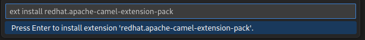
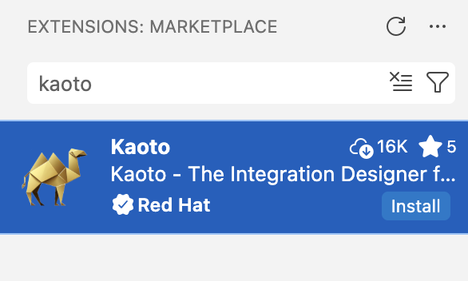

## Using our online testing instance

We have an [openly available testing instance](https://red.ht/kaoto).

As a suggestion, you can use some of our [workshops](/workshop) as guides.

Learn more about how to use Kaoto in the [Quickstart](/docs/quickstart)

## Using VS Code

### Requirements

Do you already use [Visual Studio Code](https://code.visualstudio.com/)? If you don't, you will need to install it first.

{}
To be able to easily launch and debug your integrations locally, we also suggest to install [Camel JBang](https://camel.apache.org/manual/camel-jbang.html).
{}

### Install the VS Code extension

#### a) The Complete Tooling
{}
For the best user experience and for additional supportive features, we suggest installing the [Extension Pack for Apache Camel](https://marketplace.visualstudio.com/items?itemName=redhat.apache-camel-extension-pack), which also includes the Kaoto VS Code extension.
{}

- Open your VS Code instance 
- Press <code>CTRL+P</code>
- paste 
```bash
  ext install redhat.apache-camel-extension-pack
``` 
- Hit Enter



The installation of the extension pack will automatically start and you should be able to see the progress.


#### b) Only the Kaoto editor
{}
Be aware that choosing this path will leave out very useful functionality provided by other extensions of the Extension Pack for Apache Camel. Your user experience will not be the same.
{}

- Open VS Code
- Open the Extensions view on the left side panel (or press <code>CTRL+SHIFT+X</code>)
- Type <code>Kaoto</code> in the search field
- Click the <code>Install</code> button



The [VS Code Kaoto extension](https://marketplace.visualstudio.com/items?itemName=redhat.vscode-kaoto) is embedding Kaoto as an editor.

You can find more information on how to get started on the [wiki page of the VS Code Kaoto project](https://github.com/KaotoIO/vscode-kaoto/wiki/Getting-started).



## Using Docker

The only pre-requisite is to have [docker installed](https://docs.docker.com/get-docker/).

```bash
docker pull quay.io/kaotoio/kaoto-app:main
docker run -p8080:8080 quay.io/kaotoio/kaoto-app:main
```

You can now access Kaoto on [http://localhost:8080](http://localhost:8080). If you specified a different port in the `-p` parameter above you need to adapt the URL.

Learn more about how to use Kaoto on the [Quickstart](/docs/quickstart)

Always stop the containers when finishing using Kaoto, so you don't have containers dangling:

```bash
docker stop kaoto-app
```
