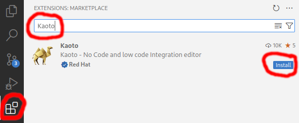

## Using our online testing instance

We have an [openly available testing instance](https://red.ht/kaoto).

As a suggestion, you can use some of our [workshops](/workshop) as guides.

Learn more about how to use Kaoto in the [Quickstart](/docs/quickstart)

## Using VS Code

### Requirements

Do you already use [Visual Studio Code](https://code.visualstudio.com/)? If you don't, you will need to install it first.

{}
To be able to easily create and launch your integrations locally, we also suggest to install [Camel JBang](https://camel.apache.org/manual/camel-jbang.html).
{}

{}
If you want to run Citrus tests for your integration, we also suggest to install [Citrus JBang](https://github.com/apache/camel-jbang-examples?tab=readme-ov-file#integration-testing).
{}

### Install the Kaoto VS Code extension
{}
We provide the Kaoto extension to be able to work as a standalone extension. It provides all the required functionality to create and run your integrations locally.
{}

- Open VS Code
- Open the Extensions view on the left side panel (or press <code>CTRL+SHIFT+X</code>)
- Type <code>Kaoto</code> in the search field
- Click the <code>Install</code> button



The [VS Code Kaoto extension](https://marketplace.visualstudio.com/items?itemName=redhat.vscode-kaoto) is embedding Kaoto as an editor.

You can find more information on how to get started on the [wiki page of the VS Code Kaoto project](https://github.com/KaotoIO/vscode-kaoto/wiki/Getting-started).

{}
Red Hat provides an [Extension Pack for Apache Camel](https://marketplace.visualstudio.com/items?itemName=redhat.apache-camel-extension-pack) which bundles extensions that might be useful for working with Apache Camel based integrations. While Kaoto itself works standalone, this extension pack can add some additional useful extensions that complement Kaoto.
{}

## Using Docker

The only pre-requisite is to have [docker installed](https://docs.docker.com/get-docker/).

```bash
docker pull quay.io/kaotoio/kaoto-app:main
docker run -p8080:8080 quay.io/kaotoio/kaoto-app:main
```

You can now access Kaoto on [http://localhost:8080](http://localhost:8080). If you specified a different port in the `-p` parameter above you need to adapt the URL.

Learn more about how to use Kaoto on the [Quickstart](/docs/quickstart)

Always stop the containers when finishing using Kaoto, so you don't have containers dangling:

```bash
docker stop kaoto-app
```
