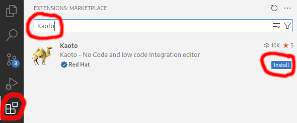

## Installation

### Requirements

#### Microsoft Visual Studio Code
Kaoto ships as a Microsoft Visual Studio Code extension. If you haven't installed VS Code on your manchine yet, please do that now.

Visit [the download page](https://code.visualstudio.com/docs/setup/setup-overview) and follow the installation instructions that apply best for you.

#### Camel CLI
To give you the best user experience we recommend to install the Camel CLI, which offers various functionalities for Camel developers.

Please follow the below steps to install it.

- Install [JBang](https://www.jbang.dev) following these [instructions](https://www.jbang.dev/download/)
- Verify that [JBang](https://www.jbang.dev) is working by executing the following from a command shell. This should output the version of installed [JBang](https://www.jbang.dev).

```bash
jbang version
```
- Run the following command from a command shell to install the [Camel CLI](https://camel.apache.org/manual/camel-jbang.html):

```bash
jbang app install camel@apache/camel
```
- Check if the [Camel CLI](https://camel.apache.org/manual/camel-jbang.html) is working by executing the following from a command shell. This should output the version of the installed [Camel CLI](https://camel.apache.org/manual/camel-jbang.html).

```bash
camel version
```

#### Citrus Testing
If you want to work with the Citrus testing framework, we strongly recommend to install the Citrus JBang plugin.

Please follow the below steps to install it.

- Install [JBang](https://www.jbang.dev) following these [instructions](https://www.jbang.dev/download/)
- Verify that [JBang](https://www.jbang.dev) is working by executing the following from a command shell. This should output the version of installed [JBang](https://www.jbang.dev).

```bash
jbang version
```
- Run the following command from a command shell to install the [Citrus JBang plugin](https://github.com/apache/camel-jbang-examples?tab=readme-ov-file#integration-testing):

```bash
jbang app install citrus@citrusframework/citrus
```
- Check if the [Citrus JBang plugin](https://github.com/apache/camel-jbang-examples?tab=readme-ov-file#integration-testing) is working by executing the following from a command shell. This should output the version of the installed [Citrus JBang plugin](https://github.com/apache/camel-jbang-examples?tab=readme-ov-file#integration-testing).

```bash
citrus --version
```

### Kaoto Extension

- Open VS Code
- Open the <code>Extensions</code> view on the left side panel (or press <code>CTRL+SHIFT+X</code>)
- Type <code>Kaoto</code> in the search field
- Click the <code>Install</code> button


