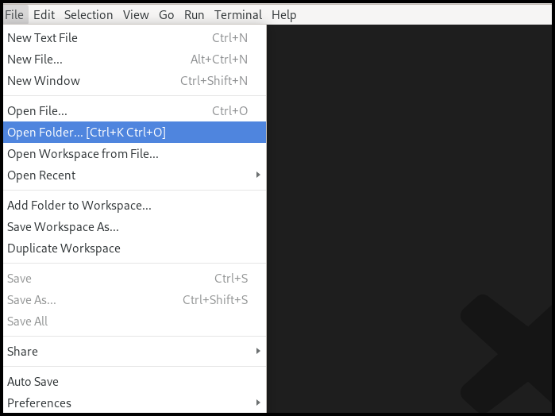
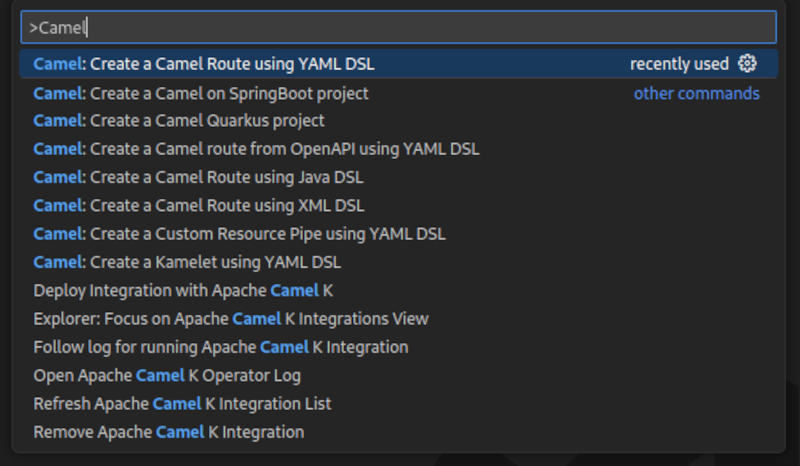
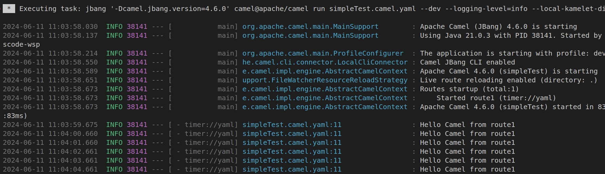

## Getting Started
This section describes how to 
- setup a workspace in VS Code
- access the important commands to create your integration
- create your first Camel Route
- run your Camel Route locally
- get access to the source code of the Camel Route

### Preparing the Workspace
Visual Studio Code requires you to create a workspace for your project to access the full functionality of the environment. If you haven't done so yet, please open your Visual Studio Code instance. You can do that by finding the right launcher on your computer or by opening a command shell and executing <code>code</code>. This should leave you with a window like the one below.

Next we need to select our workspace folder which will store our project files. Go to the <code>File</code> menu and select the entry <code>Open Folder</code>. In the following screen browse to the folder you would like to use and select it. 

### VS Code Commands
{}
Some VS Code commands require a workspace to show up and function correctly. If you haven't set one up and opened it you should check the [Preparing the Workspace](#preparing-the-workspace) section.
{}

To access the VS Code command palette you have to press either <code>F1</code> or <code>CTRL+SHIFT+P</code>. This will open up an entry field which you can use to filter for the commands you are interested in. 

In our case we are interested in the <code>Camel</code> related commands, so lets type <code>Camel</code> into the field and check the filtered results.

### Create your first Camel Route
If you followed the steps from the  section you should still see the filtered Camel commands. Please select now the command called <code>Camel: Create a Camel Route using YAML DSL</code> and hit <code>Enter</code>. Next you are asked to provide a name for the file to be created. Feel free to pick a name without stating a file extension (example: <code>simpleTest</code>) and hit <code>Enter</code> again.

{}
If the execution fails you should double check if you have installed the [Camel CLI](https://camel.apache.org/manual/camel-jbang.html) correctly. Follow the instructions outline in the section [Camel CLI](#camel-cli) section.
{}

If all worked correctly you should now see your new file with the extension <code>.camel.yaml</code> and the Kaoto Visual Designer should open up.
{}
If the Kaoto editor doesn't open check you followed the [Install Kaoto](#install-kaoto) section and your file is named like <code>_filename.camel.yaml_</code>. If you named the file differently then rename it to match this naming rule.
{}

You should now see a similar screen like the one below.

### Launch your Camel Route
The Camel Route we created in the [previous chapter](#create-your-first-camel-route) can already be launched. Let's try to start the Route by clicking the <code>Run Camel Application with JBang</code> button in the top right of the Kaoto Visual Editor.

A terminal should open up and it will show you the output of your launched Camel Route.

You can terminate the execution of your Camel Route at any time by selecting the terminal window and pressing <code>CTRL+C</code>.

### Accessing the Source Code
You might wonder how the source of your new Camel Route looks like. While Kaoto tries relief users from the burden of working with the source code, we still allow access to it via the default Visual Studio Code Text Editor. 

To access your source code you can either right click the tab labeled with the filename and then select <code>Reopen Editor with</code> and then choosing <code>Text Editor</code>.

Another way of doing that is to right-click the file in the Explorer view on the left side of the window and then similarly selecting the menu item <code>Open With</code> and then choosing <code>Text Editor</code>.

If you want to revert back to the Kaoto Editor you can follow the same steps as above but instead of <code>Text Editor</code> you should then select <code>Kaoto Editor</code>.
