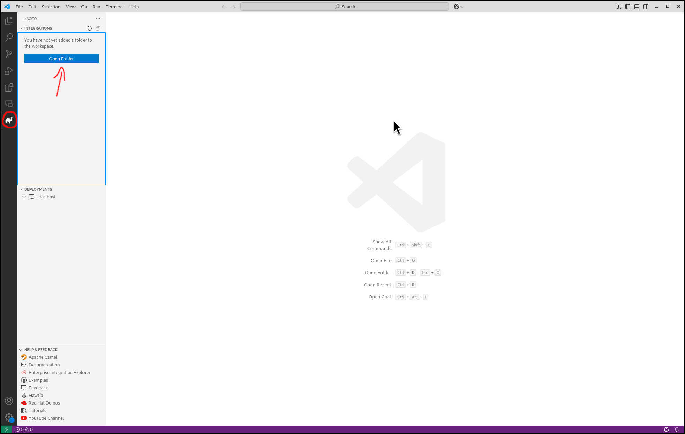

## Getting Started
This section describes how to 
- setup a workspace in VS Code
- access the important commands to create your integration
- create your first Camel Route
- run your Camel Route locally
- get access to the source code of the Camel Route

### Preparing the Workspace
Visual Studio Code requires you to create a workspace for your project to access the full functionality of the environment. If you haven't done so yet, please open your Visual Studio Code instance. You can do that by finding the right launcher on your computer or by opening a command shell and executing <code>code</code>. This should leave you with a window like the one below. _(in the picture below we selected already the Kaoto view - see the Kaoto Camel icon)_

Next we need to select our workspace folder which will store our project files. You can either click on the <code>Open Folder</code> button or you can also go to the <code>File</code> menu and select the entry <code>Open Folder</code>. In the following screen browse to the folder you would like to use and select it. 

### Create your first Camel Route
With the `Kaoto` view (the Kaoto Camel icon) on the left sidebar open you will see the `Integration` section on top. When moving the mouse to the right side of the `Integrations` headline you will see some small icons, one of the is a file with a plus sign. Click on it, select `New Camel Route` and follow the instructions to create your first Camel Route.

Once done, the new file will be created and the Kaoto editor should appear as shown in the video below. If the editor does not appear, revisit the earlier steps to ensure you followed all instructions correctly.

<video controls width="600">
  <source src="create-integration.mp4" type="video/mp4">
  Your browser does not support the video tag.
</video>

At this point, you have successfully created your first working Camel Route, which can be tested immediately.

{}
If the execution fails you should double check if you have installed the [Camel CLI](https://camel.apache.org/manual/camel-jbang.html) correctly. Follow the instructions outline in the section [Camel CLI](#camel-cli) section.
{}

You should now see a similar screen like the one below.

### Launch your Camel Route
Testing your integration is easy and straigth forward. In the `Integrations` section hover over the file name of your integration and this will reveal some useful buttons. One of these buttons is a Camel icon with a green play button. Click it to launch your integration locally using [Camel JBang](https://camel.apache.org/manual/camel-jbang.html). Please check the below video which will show you how to launch the integration and possible actions to interact with a running integration.

<video controls width="600">
  <source src="launch-integration.mp4" type="video/mp4">
  Your browser does not support the video tag.
</video>

As you can see in the video your integration is launched in Dev Mode and changes to the integration via the Kaoto editor or the source code will be reloaded whenever you save. This will help you prototyping faster.

### Accessing the Source Code
You might wonder how the source of your new Camel Route looks like. While Kaoto tries to relief users from the burden of working with the source code, we still allow access to it via the default Visual Studio Code Text Editor. 

There are two ways to achieve this. First you can use the <code>Open Source Code</code> toggle button on the top right of the Kaoto editor. This is the most convenient way. Another option is to invoke the context menu on the tab with the file name of your integration and then use the <code>Reopen Editor with</code> item. Both ways are shown in the following video.

<video controls width="600">
  <source src="show-source.mp4" type="video/mp4">
  Your browser does not support the video tag.
</video>

