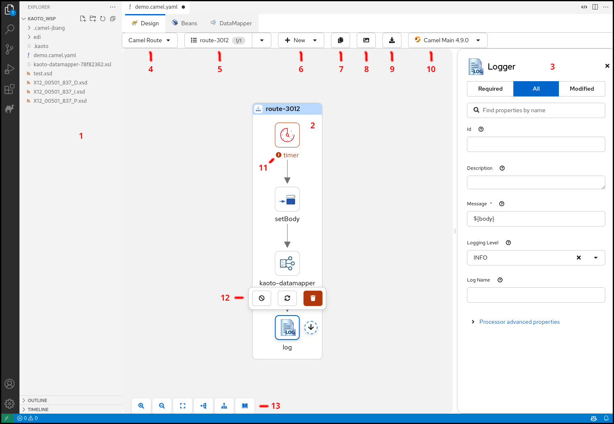
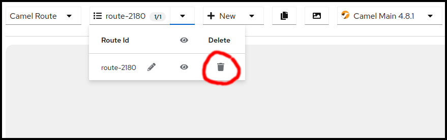
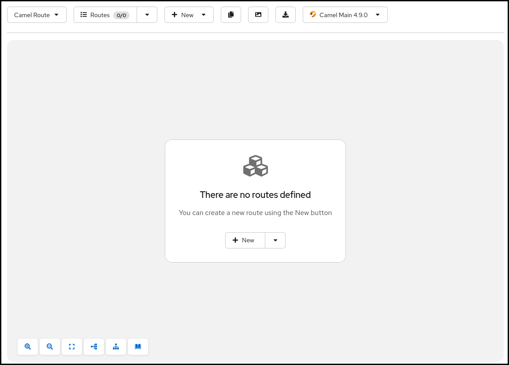
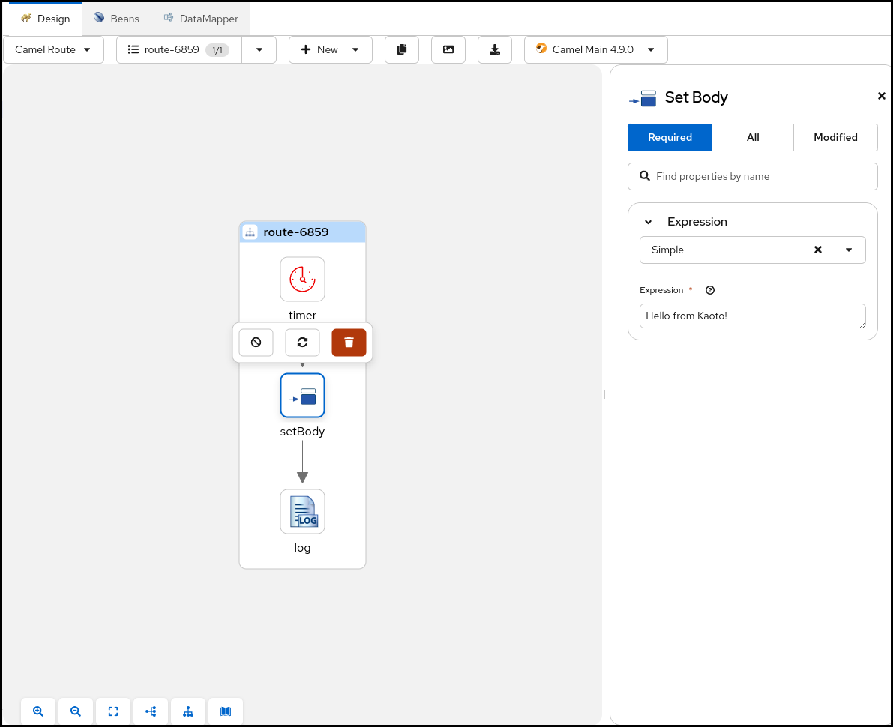
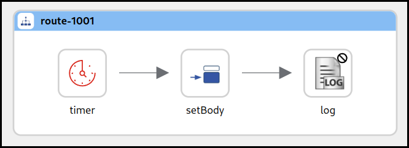
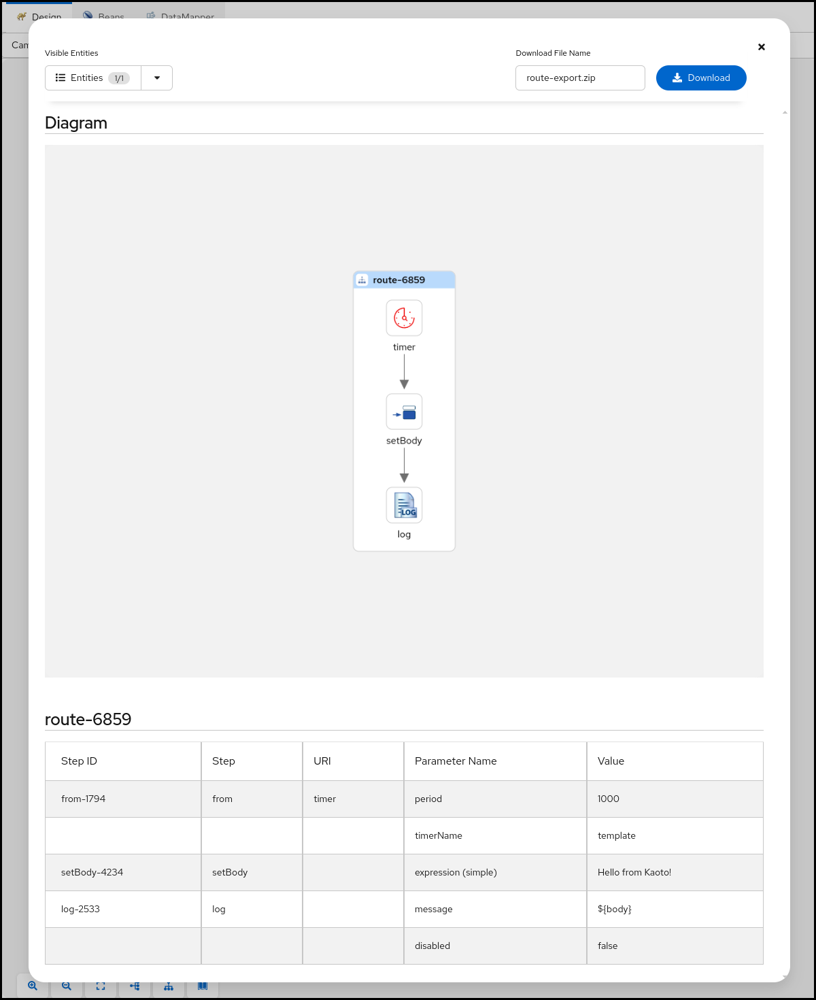

## The Visual Designer

### Overview

The following picture shows the different parts of the Kaoto Visual Editor.

1. The Explorer View with the opened file selected
2. The currently displayed Integration
3. The configuration panel where you can adjust and customize settings for the selected step
4. Drop down showing the currently selected integration type, here **Camel Route**
5. Drop down showing the currently selected Camel Route. This is handy if you have more than one Camel Route defined in your file. You can rename, delete, select and switch the visibility for each Camel Route here
6. Drop down enabling you to add more Routes or other global elements to your integration. **Only visible for Camel Routes!**
7. Copies the full source code of your integration to the Clipboard
8. Exports the currently visible Integration as a PNG image
9. Generate a documentation for your integration and download it in Markdown format.
10. Drop down showing the available Camel versions. Different runtimes are available, like Camel Main, Springboot and Quarkus.
11. A step in your Integration with an **Error**-Marker to indicate a problem with the configuration of the step.
12. The toolbar of the selected step. It provides available actions for the current selection.
13. This button bar provides you with functionalities like Zoom In / Out, Reset the View, Switching the layout direction between horizontal and vertical and grants you access to the comprehensive Camel Catalog, containing all the available Components/Connectors, Enterprise Integration Patterns and Kamelets

### Working with Camel Routes

In [Apache Camel](https://camel.apache.org), a route is a set of processing steps that are applied to a message as it travels from a source to a destination. A route typically consists of a series of processing steps that are connected in a linear sequence.

A Camel Route is where the integration flow is defined. For example, you can write a Camel Route to specify how two systems can be integrated. You can also specify how the data can be manipulated, routed, or mediated between the systems.

#### Creating a new Camel Route

We already covered how to create a new Camel Route YAML file in the chapter [Create your first Camel Route](#create-your-first-camel-route).

Let's use another way of creating a new Camel Route. If you have your route from the other chapter still open, click on the Route selection drop down and then delete all the routes using the trashbin icon.

Once you confirmed the deletion of all your routes you should see a blank screen like below.

You can now create a new Camel Route by either clicking the <code>+ New</code> button in the center of the canvas or by using the same button in the upper menu bar of the Canvas, next to the Route selection drop down, which will both put a template route in place which uses a **Timer** component to send every second a message to the **Log** component.

#### Adding a step

Now lets add a new step between the **Timer** and the **Log** component to modify the message body. There are two ways of adding a step to the route. You can either Right-Click on the step you want to insert before or after. This will bring up a context menu with the available actions to choose from. An easier alternative would be to hover over the connection between the two steps you want to insert between and then click on the **+** button that appears.

Hover over the connection between the **Timer** and the **Log** steps now and click the **+** button to execute the **Add step** action.

> [!NOTE]
> When using the right-click context menu, the set of available actions depend on the selected step and can vary. There are actions for appending, prepending, replacing and deleting steps as well as some more specialized actions.

This will open up the Camel Catalog where you can search the step you want to add.

As already mentioned we would like to modify the message body before sending it along to the **Log** component. To achieve that we need to add a **Processor** called **setBody**. Let's enter this name into the filter text field on top of the Catalog.

You can now select the **setBody** tile to add it to your route. Select the new added step now on the canvas to open the configuration form to the right.

Let's change the **Expression** text field to <code>Hello from Kaoto!</code>.

Now the **Log** component will receive a <code>Hello from Kaoto!</code> message every second and logs it to the console.

> [!NOTE]
> When using the right click context menu of a step, adding new steps is usually done with two actions. **Prepend** can be used to add a step _before_ the selected step and **Append** will add the new step _after_ the selected step.
> However, on the first step of a flow and on steps that can have children, the **Add Step** action is used.

#### Replacing a step

You can replace any step on the canvas by hovering over or by selecting the step. This will spawn a toolbar which contains a button for the Replace action.

Alternatively you can do that also by invoking the context menu on a step and selecting the item **Replace**.
Both ways it will open up the Camel Catalog and you can choose the replacement from there.

#### Deleting a step

> [!WARNING]
> When invoking the **Delete** action on a step with children or on a container element containing children there will be a confirmation dialog because you are about to delete not just the single step or container but also all the contained children. **Be cautious**!

You can delete any step on the canvas by hovering over or by selecting the step. This will spawn a toolbar which contains a button for the Delete action.

Alternatively you can do that also by invoking the context menu on a step and selecting the item **Delete**. This will remove the step from your integration.

#### Enable / Disable a step

You can enable or disable any step on the canvas by hovering over or by selecting the step. This will spawn a toolbar which contains a button for the Enable / Disable action.

> [!NOTE]
> Disabling a step will instruct the [Apache Camel](https://camel.apache.org) runtime to ignore the step when executing the flow. This can be convenient when prototyping a new route.

Alternatively you can enable / disable any step in your route by invoking the context menu on a step and selecting the item **Enable / Disable**.  

In the picture above the **Log** component has been disabled. The icon is grayed out and there is a marker icon at the top right of the step to indicate it is disabled.

#### Generate Integration Documentation

You can use the built-in documentation generating feature to create a Markdown file containing all the steps in your integration and all the changed parameters for these steps together with an image of your integration.

When you click the button it will open up a dialog with a preview of your integration documentation.

You can use the **Visible Entities** control in the top left of the dialog to control which routes are part of the documentation. You can either select all, just a subset or even just a single route. Once you have made your choice you can specify a file name in the top right and then hit the **Download** button to retrieve the file in ZIP format.
