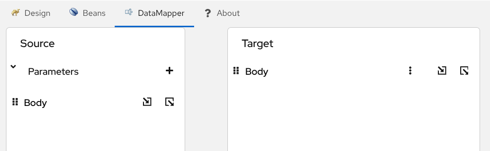
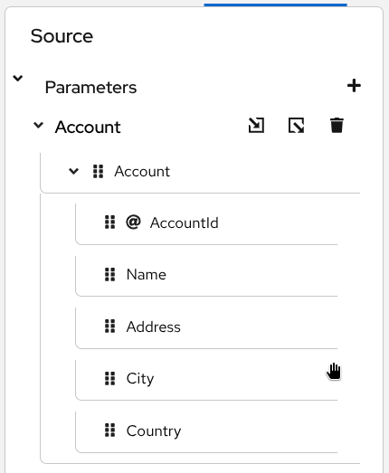
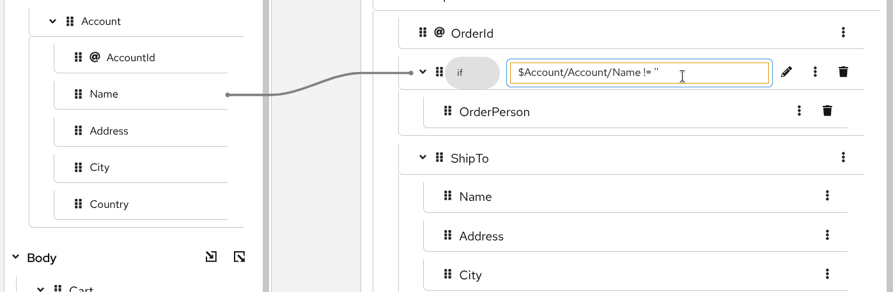
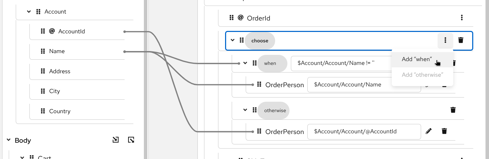
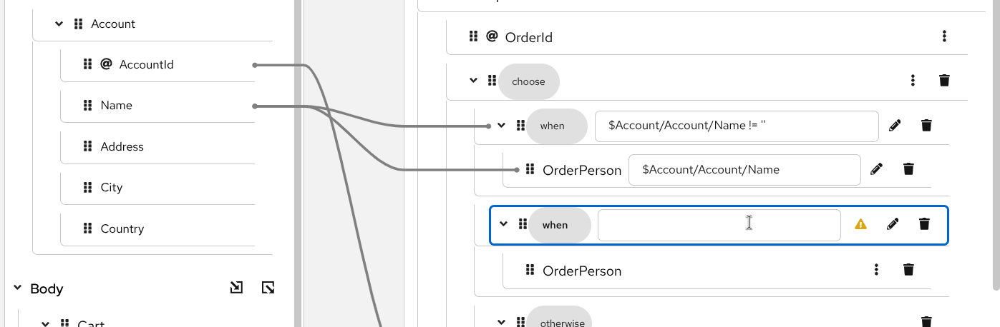
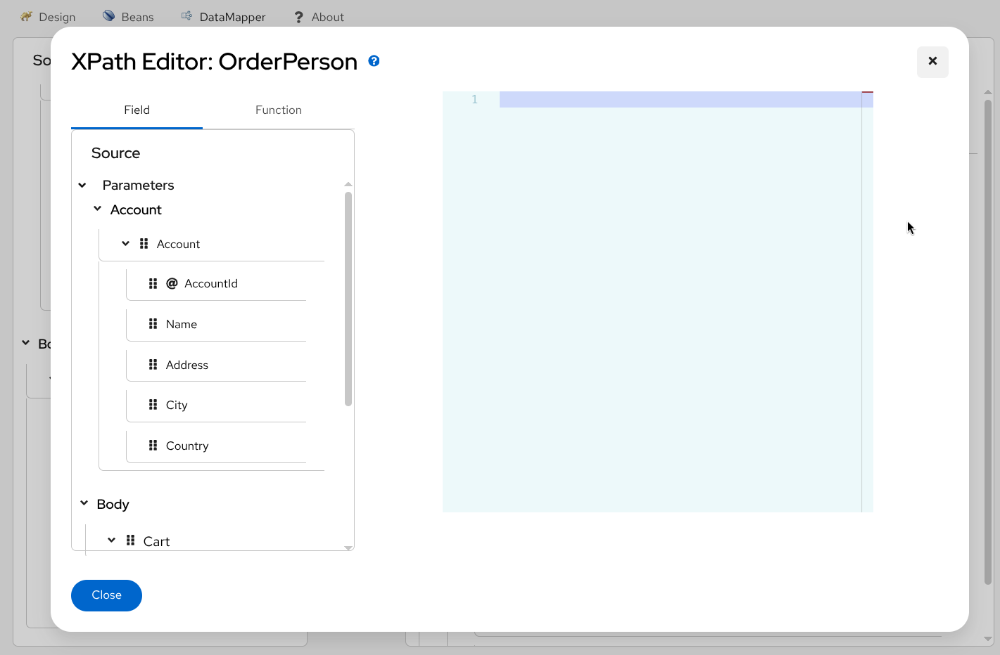
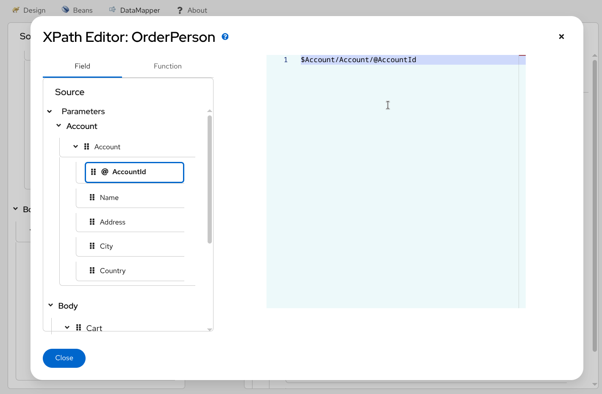
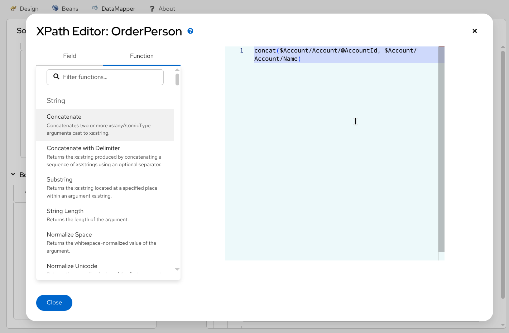

## Kaoto DataMapper
{}
Currently Kaoto DataMapper is only supported inside the Visual Studio Code extension as a technical preview feature. In the future we will aim to bring this functionality also to the pure web version of Kaoto.
{}

{}
The DataMapper supports both XML and JSON schema for rendering the data structure. For both XML and JSON data, it internally generates a single XSLT step to perform configured data mappings at runtime. For JSON data, it leverages the json-to-xml() and xml-to-json() functions available in XSLT 3.0 to handle JSON transformations. While you can consume multiple XML/JSON documents using Camel Variables and/or Message Headers which are mapped to transformation parameters, the output is only a Camel Message Body.
{}

In addition to the regular Camel steps, Kaoto supports a **Kaoto DataMapper** step to be placed in the Camel Route. The Kaoto DataMapper step provides a graphical user interface to create data mappings inside the Camel Route.

### Adding a DataMapper step
1. Add a **Kaoto DataMapper** step in your Camel route. When you `Append`, `Prepend` or `Replace` a step in the Kaoto Design view, you can find the **Kaoto DataMapper** step in the catalog.

2. Click the added **Kaoto DataMapper** step in the Kaoto Design to open the config form.

3. In the config form, click the `Configure` button.

4. This will open the visual DataMapper editor.

### Source and Target
In the DataMapper editor, you can see a `Source` section at the left and a `Target` section at the right side.

The `Source` section represents the input side of your mappings, where the DataMapper step reads the data from. This is mapped to the incoming Camel `Message` as well as possible Camel `Variables`.
 
The `Target` section represents the output side of your mappings, where the DataMapper step writes the data to. This is mapped to the outgoing Camel `Message`.

### Parameters

The `Parameters` section inside the `Source` section is mapped to any of the incoming Camel `Variables` and `Message Headers`. For example, if there is an incoming Camel Variable `orderSequence`, you can consume it by adding a parameter `orderSequence` in the DataMapper Source/Parameters section.

Follow the below steps to add a parameter.

1. Click the plus __+__ button on the right side of the `Parameters` title.

2. Now type the parameter name and click the check button on the right.

{}
While Camel Exchange Properties are also mapped to parameters in the current `camel-xslt-saxon` implementation, after the [Camel Variables](https://camel.apache.org/manual/variables.html) have been introduced, it is no longer recommended to store application data in Camel Exchange Properties. We encourage to use [Camel Variables](https://camel.apache.org/manual/variables.html) instead.
{}

### Attaching Document Schema files
If any of `Source Body`, `Target Body` and/or `Parameter(s)` are structured data, you can attach a schema file and visualize the data structure in a tree style view. The DataMapper supports both XML Schema (XSD) and JSON Schema files.
{}
If the data is not structured and just a primitive value, you don't need to attach a schema file.
{}

{}
JSON schemas can be attached to `Target Body` and `Parameter(s)`. However, it is currently not supported to attach JSON schema to `Source Body`.
{}

Follow the below steps to attach a schema file.
1. Place schema file(s) inside the workspace directory.

2. Click `Attach a schema` button in one of the `Source Body`, `Target Body` or `Parameters` sections.

3. In the Attach schema modal, click the file button.

4. Select the schema file to attach.

5. **New!** (XML only) Select the root element. The first element in the schema is selected by default. If the XML schema defines multiple top level elements and you want to use the other element than the first one, select one from the dropdown. This step is applicable only for XML. For JSON, skip to the next.

Here is a demo screencast to choose a root element.


6. Click `Attach` button.

7. Now the document structure is rendered inside a tree.

### JSON Schema Document
Kaoto DataMapper supports reading structured JSON parameter(s) and writing a JSON target body. If any of them is
a structured JSON data and you have a JSON schema which defines the JSON data structure, you can attach
the JSON schema file, render the document tree in DataMapper UI and create data mappings with it.

Follow the below steps to attach a JSON schema file.
1. Place schema file(s) inside the workspace directory.

2. Click `Attach a schema` button in one of the `Target Body` or `Parameters` sections.

3. In the Attach schema modal, click the file button.

4. Select the schema file to attach.

5.  If the file extension is `.json`, it automatically switch the radio button below to `JSON Schema`. Otherwise, choose `JSON Schema`. Click `Attach` button.

6. Now the JSON schema document structure is rendered inside a tree.

Here is a demo screencast for creating JSON mappings.


#### JSON schema document tree

{}
Kaoto DataMapper uses XSLT 3.0 `json-to-xml()` and `xml-to-json()` functions to support JSON mappings. JSON document specific characteristics described in this section are mostly influenced by these XSLT 3.0 JSON support functions. Please visit XSLT 3.0 specification for more internal details.
- [json-to-xml()](https://www.w3.org/TR/xslt-30/#func-json-to-xml)
- [xml-to-json()](https://www.w3.org/TR/xslt-30/#func-xml-to-json)
{}

When an XML schema document is rendered in DataMapper document tree, their element name and attribute name alone is shown as the field label. For JSON schema document, it is slightly different. Since JSON
document field sometimes doesn't have a name (anonymous), it uses field type as a primary field label.
- `map` : object field
- `array` : array field
- `string` : string field
- `number` : number field

In addition to that, if the field has a name, it will show as a `@key` attribute following the field type.
For example, a `string` type field with a name `AccountId` will show the field label `string [@key = AccountId]`.

An anonymous object field will show just `map`.

There is one thing that requires attention for `array` type field. The `array` type field indicates that its __children__ are collection, in other words repeating field, but not the `array` type field itself.
For example, `array` type field with the name `Item` is rendered in DataMapper UI as following:

In this case, the `map` type field which is a direct child of `array` type field `Item`, is a collection field. The layer icon  indicates that the `map` field is a collection field. This is important when creating a `for-each` mapping. We will look into how to create a `for-each` mapping in details [later in this manual](#create-a-for-each-mapping).  

Here is an example JSON data mappings created in Kaoto DataMapper UI. It consumes `Account` and `Cart` structured JSON parameters as well as `orderSequence` primitive parameter, and create a `ShipOrder` JSON target body.

You might notice that in the XPath expression, it uses `$Account-x` to refer the parameter `Account`, not just `$Account`, but with a suffix `-x`.
Since `Account` parameter is a structured JSON, it is internally converted into XML with using `json-to-xml`. `$Account-x` is a variable which stores that XML document converted from JSON.
When data mappings are created through drag and drop, Kaoto DataMapper automatically handles that.
However when you edit the XPath expression manually, please keep this fact in mind.

With those JSON specific characteristics in mind, the rest of the way how to create mappings is same for
XML and JSON. You can create mappings for XML to XML, XML to JSON, JSON to XML and JSON to JSON with Kaoto DataMapper. We will look into those in the following sections.

### Creating simple mappings

#### Creating a mapping by dragging and dropping a field
When you perform drag and drop between the source and the target, a mapping is created and a line is drawn between the fields.

__Example:__ Mapping the `Name` fields by dragging and dropping the source `Name` field on the target `Name` field.

__Before:__
 
__After:__ 

#### Creating a mapping by typing an XPath expression
You can also create a mapping by entering a `XPath` expression.

1. Click the 3 dots context menu on the target field and choose `Add selector expression`.
 

2. Then enter the `XPath` expression.

### Creating conditional mappings
The DataMapper supports creating 3 types of conditional mappings:
- `if` - The mapping is created only when the specified condition is met.
- `choose-when-otherwise` - The mapping is created depending on how the condition is satisfied. If the `when` branch condition is satisfied, the `when` branch mapping is created. If no `when` branch condition is satisfied, then the `otherwise` branch mapping is created.   
- `for-each` - The mapping is created for each item in the collection. Collection means multiple occurrences, which is often represented as an array.

#### Create a `if` mapping
1. Click the 3 dots context menu on the target section's field. Then select `wrap with "if"` to create a mapping.

2. Configure the `if` condition. You can drag the source field and drop it into the input field to start writing a condition, or alternatively type everything manually.

3. Configure the mapping by using drag and drop or by typing it manually.

#### Create a `choose-when-otherwise` mapping
1. Click the 3 dots context menu on the target section's field. Then select `wrap with "choose-when-otherwise"` to create a mapping.

2. Configure the `when` condition.

3. Configure the mapping for the `when` branch.

4. Configure the mapping for the `otherwise` branch.

5. If required, you can add one or more `when` branches. To add another `when` branch you can click the 3 dots menu on the `choose` field in the `Target` section and then select `Add "when"`.

#### Create a `for-each` mapping
When a field is a collection field (means multiple occurrences, often represented as an array), you can create a `for-each` mapping. The layer icon on the field indicates that it is a collection field.

1. Click the 3 dots context menu on the target section's collection field. Then select `wrap with "for-each"` to create a mapping.

2. Configure the `for-each` condition by specifying the source collection field to iterate over.

3. Configure the mappings below. Note that the mapping field path is now a relative path from the collection field specified in the `for-each` condition.

### Create multiple mappings for a collection target field
A target collection field can have multiple mappings. For example, it can have multiple `for-each` loops
to merge 2 different source collection fields into one target collection field. Once you create a first
mapping, you will see a place holder which has buttons to add more mappings.

1. After creating a first `for-each` mapping by following [previous section](#create-a-for-each-mapping), click `Add Conditional Mapping` in the placeholder below the added `for-each` mapping

2. Click `Wrap with "for-each"`

3. Map other source collection to the added `for-each` mapping

4. Create subsequent mappings

Here is a demo screencast for merging 2 source collection fields with multiple `for-each` mappings.


### Using XPath expression editor
{}
The `XPath` editor is still under initial development and it currently supports only limited drag and drop. In future releases, more syntax assisting features will be added.
{}

If you want to write something more in XPath expression rather than just a field path, you can launch the `XPath` expression editor and work with it. There is a pencil icon on the target field which launches the `XPath` expression editor when you click it.

1. Click the pencil button on a target field which has a mapping.

2. This will open up the `XPath` editor.

3. You can then type in the editor at the right or drag a `Field` from the left and drop onto the editor.

4. You can also drag and drop `XPath` functions from the `Function` tab on the left side.

5. Drag the function and drop it onto the editor.

6. Once it's completed, click the `Close` button at the bottom left.

7. Now you can see the new mapping in the tree view.

### Delete a mapping
1. To delete a mapping you can click the dustbin button next to the target field.

2. You then have to confirm the deletion by clicking the `Confirm` button.

### Delete a parameter

1. To delete a parameter, click the dustbin button next to the parameter.

2. You then have to confirm the deletion by clicking the `Confirm` button.

### Detach a schema
Similar to attaching a schema you can also remove / detach a schema. 

1. Click the `Detach schema` button.

2. Click the `Confirm` button.

