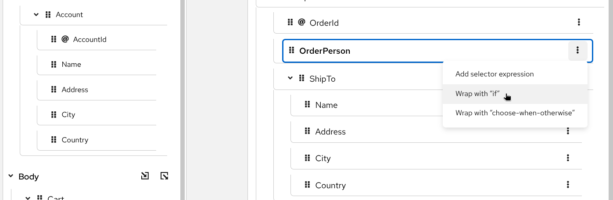
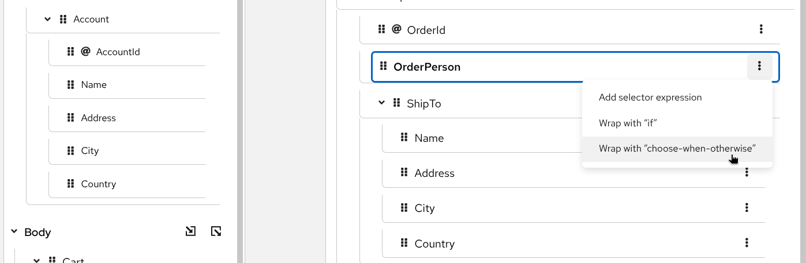
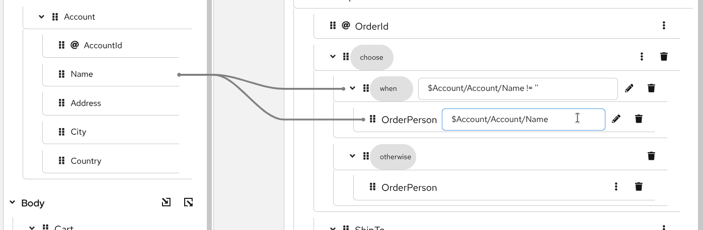
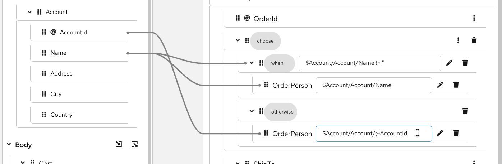
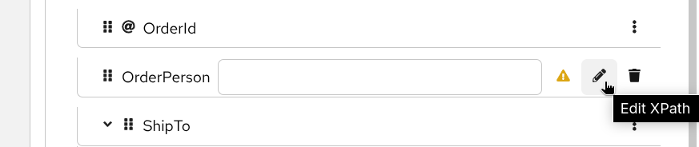
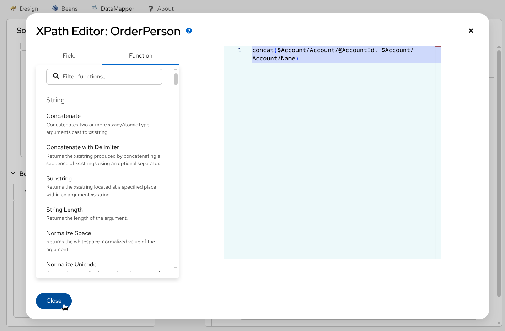
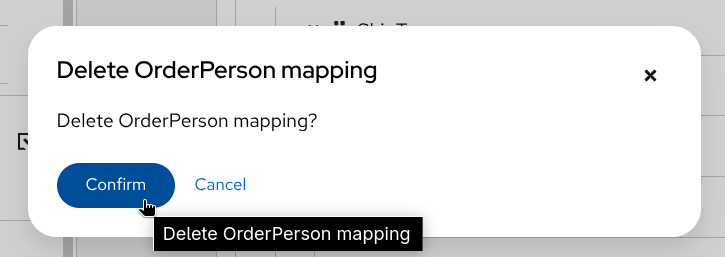
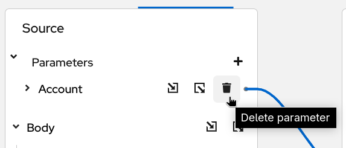
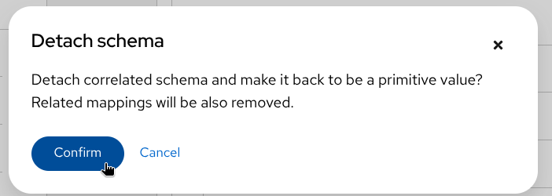

## Kaoto DataMapper
{}
Currently Kaoto DataMapper is only supported inside the Visual Studio Code extension as a technical preview feature. In the future we will aim to bring this functionality also to the pure web version of Kaoto.
{}

{}
At the moment the DataMapper only supports XML schema for rendering the data structure and it internally generates a single XSLT step to perform configured data mappings at runtime. While you can consume multiple XML documents with using Camel Variables and/or Message Headers which are mapped to XSLT parameters, the output is only a Camel Message Body.
{}

In addition to the regular Camel steps, Kaoto now supports a **Kaoto DataMapper** step to be placed in the Camel Route. The Kaoto DataMapper step provides a graphical user interface to create data mappings inside the Camel Route.

### Adding a DataMapper step
1. Add a **Kaoto DataMapper** step in your Camel route. When you `Append`, `Prepend` or `Replace` a step in the Kaoto Design view, you can find the **Kaoto DataMapper** step in the catalog.

2. Click the added **Kaoto DataMapper** step in the Kaoto Design to open the config form.

3. In the config form, click the `Configure` button.

4. This will open the visual DataMapper editor.

### Source and Target
In the DataMapper editor, you can see a `Source` section at the left and a `Target` section at the right side.

The `Source` section represents the input side of your mappings, where the DataMapper step reads the data from. This is mapped to the incoming Camel `Message` as well as possible Camel `Variables`.
 
The `Target` section represents the output side of your mappings, where the DataMapper step writes the data to. This is mapped to the outgoing Camel `Message`.

### Parameters

The `Parameters` section inside the `Source` section is mapped to any of the incoming Camel `Variables` and `Message Headers`. For example, if there is an incoming Camel Variable `orderSequence`, you can consume it by adding a parameter `orderSequence` in the DataMapper Source/Parameters section.

Follow the below steps to add a parameter.

1. Click the plus __+__ button on the right side of the `Parameters` title.

2. Now type the parameter name and click the check button on the right.

{}
While Camel Exchange Properties are also mapped to parameters in the current `camel-xslt-saxon` implementation, after the [Camel Variables](https://camel.apache.org/manual/variables.html) have been introduced, it is no longer recommended to store application data in Camel Exchange Properties. We encourage to use [Camel Variables](https://camel.apache.org/manual/variables.html) instead.
{}

### Attaching Document Schema files
If any of `Source Body`, `Target Body` and/or `Parameter(s)` are structured data, you can attach a schema file and visualize the data structure in a tree style view. 
{}
If the data is not structured and just a primitive value, you don't need to attach a schema file.
{}

Follow the below steps to attach a schema file.
1. Place schema file(s) inside the workspace directory.

2. Click `Attach a schema` button in one of the `Source Body`, `Target Body` or `Parameters` sections.

3. Select the schema file to attach.

4. Now the document structure is rendered inside a tree.

### Creating simple mappings

#### Creating a mapping by dragging and dropping a field
When you perform drag and drop between the source and the target, a mapping is created and a line is drawn between the fields.

__Example:__ Mapping the `Name` fields by dragging and dropping the source `Name` field on the target `Name` field.

__Before:__
 
__After:__ 

#### Creating a mapping by typing an XPath expression
You can also create a mapping by entering a `XPath` expression.

1. Click the 3 dots context menu on the target field and choose `Add selector expression`.

2. Then enter the `XPath` expression.

### Creating conditional mappings
The DataMapper supports creating 3 types of conditional mappings:
- `if` - The mapping is created only when the specified condition is met.
- `choose-when-otherwise` - The mapping is created depending on how the condition is satisfied. If the `when` branch condition is satisfied, the `when` branch mapping is created. If no `when` branch condition is satisfied, then the `otherwise` branch mapping is created.   
- `for-each` - The mapping is created for each item in the collection. Collection means multiple occurrences, which is often represented as an array.

#### Create a `if` mapping
1. Click the 3 dots context menu on the target section's field. Then select `wrap with "if"` to create a mapping.

2. Configure the `if` condition. You can drag the source field and drop it into the input field to build a condition, or alternatively type everything manually.

3. Configure the mapping by using drag and drop or by typing it manually.

#### Create a `choose-when-otherwise` mapping
1. Click the 3 dots context menu on the target section's field. Then select `wrap with "choose-when-otherwise"` to create a mapping.

2. Configure the `when` condition.

3. Configure the mapping for the `when` branch.

4. Configure the mapping for the `otherwise` branch.

5. If required, you can add one or more `when` branches. To add another `when` branch you can click the 3 dots menu on the `choose` field in the `Target` section and then select `Add "when"`.

#### Create a `for-each` mapping
When a field is a collection field (means multiple occurrences, often represented as an array), you can create a `for-each` mapping. The layer icon on the field indicates that it is a collection field.

1. Click the 3 dots context menu on the target section's collection field. Then select `wrap with "for-each"` to create a mapping.

2. Configure the `for-each` condition by specifying the source collection field to iterate over.

3. Configure the mappings below. Note that the mapping field path is now a relative path from the collection field specified in the `for-each` condition.

### Using XPath expression editor
{}
The `XPath` editor is still under initial development and it currently supports only limited drag and drop. In future releases, more syntax assisting features will be added.
{}

If you want to write something more in XPath expression rather than just a field path, you can launch the `XPath` expression editor and work with it. There is a pencil icon on the target field which launches the `XPath` expression editor when you click it.

1. Click the pencil button on a target field which has a mapping.

2. This will open up the `XPath` editor.

3. You can then type in the editor at the right or drag a `Field` from the left and drop onto the editor.

4. You can also drag and drop `XPath` functions from the `Function` tab on the left side.

5. Drag the function and drop it onto the editor.

6. Once it's completed, click the `Close` button at the bottom left.

7. Now you can see the new mapping in the tree view.

### Delete a mapping
1. To delete a mapping you can click the dustbin button next to the target field.

2. You then have to confirm the deletion by clicking the `Confirm` button.

### Delete a parameter

1. To delete a parameter, click the dustbin button next to the parameter.

2. You then have to confirm the deletion by clicking the `Confirm` button.

### Detach a schema
Similar to attaching a schema you can also remove / detach a schema. 

1. Click the `Detach schema` button.

2. Click the `Confirm` button.

