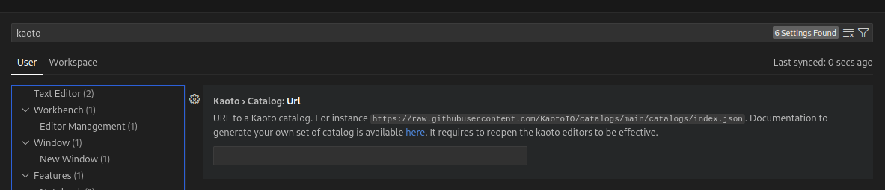
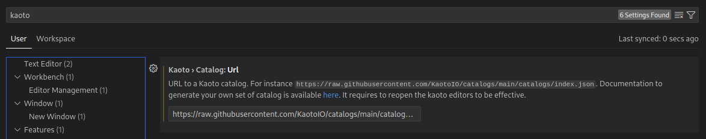

## Overview
By default, every Kaoto release includes the latest Camel version available at the moment of the build, nevertheless, generating a different set of catalogs is possible.

### Catalog generator CLI
Kaoto provides a Camel catalog generator CLI to ease this process, it supports the following runtimes:
* Main
* Quarkus
* Spring Boot

#### How to use?

1. Clone [the Kaoto Camel catalog project](https://github.com/KaotoIO/camel-catalog/)
2. Navigate to the `camel-catalog` directory
3. Install the project dependencies
```bash
yarn install
```

4. Build the default catalogs
```bash
yarn build
```

5. This will generate a Catalog library containing:
    * Camel Main versions
    * Camel extensions for Quarkus
    * Camel Spring boot
    * Camel Kamelets

> To check what specific versions are included, please visit [the index file](https://github.com/KaotoIO/camel-catalog/blob/main/index.js)
{.note}

6. The resulting files will be in the `catalog` folder
> The latest catalog is version is available in [the GitHub repository](https://github.com/KaotoIO/camel-catalog/tree/main/catalog)
{.note}

7. Providing that folder through a http server will make it available for using it in Kaoto

#### Creating a Catalog library with different runtimes
In order to add multiple runtimes to the Catalog library, we can provide each runtime with its version using the following flags:

```bash
 -m,--main <version>               Camel Main version. If not specified,
                                   it will use the generator installed
                                   version
 -q,--quarkus <version>            Camel Extensions for Quarkus version
 -s,--springboot <version>         Camel SpringBoot version
```

For instance, running the following command will create a Catalog library with Camel Main 4.15.0 and Camel extensions for Quarkus 3.27.0:
```bash
./mvnw package; java -jar ./target/catalog-generator-0.0.1-SNAPSHOT.jar -o ./dist/camel-catalog -k 4.15.0 -m 4.15.0 -q 3.27.0 -n "My Catalog"
```

For a different Kamelets catalog version, the `--kamelets or -k` flag can be specified
```bash
./mvnw package; java -jar ./target/catalog-generator-0.0.1-SNAPSHOT.jar -o ./dist/camel-catalog -k 4.15.0 -m 4.15.0  -n "My Catalog"
```

### How to instruct Kaoto to use a specific Catalog library
1. In VSCode, go to the settings page and look for "Kaoto"




2. In the `TextField`, provide the URL of the `index.json` file that specifies the location of the subsequent catalogs, for instance, the public Kaoto catalog can be used:




3. Restart Kaoto for the changes to have effect


