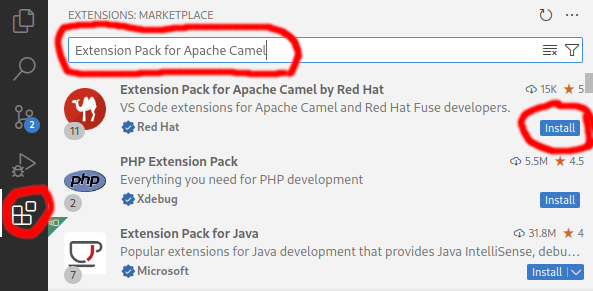
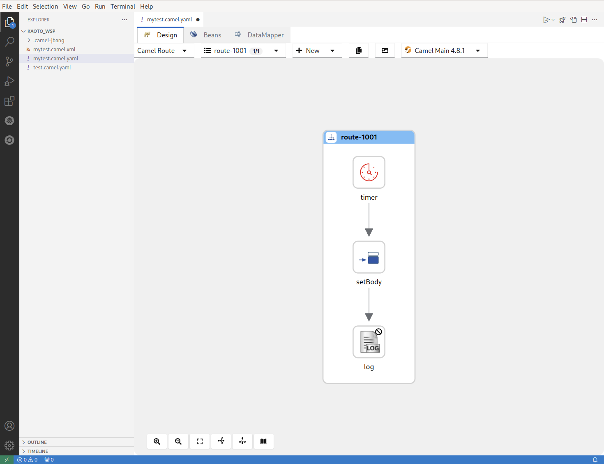
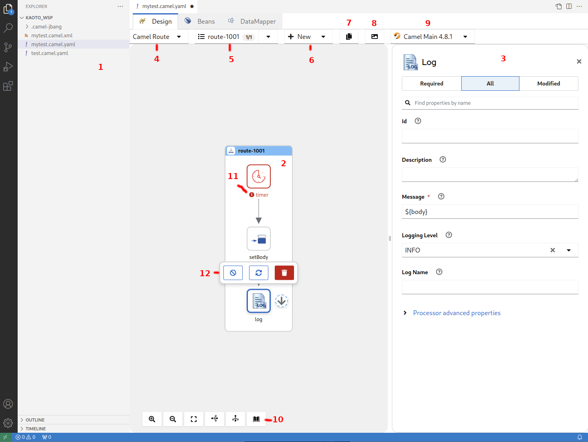
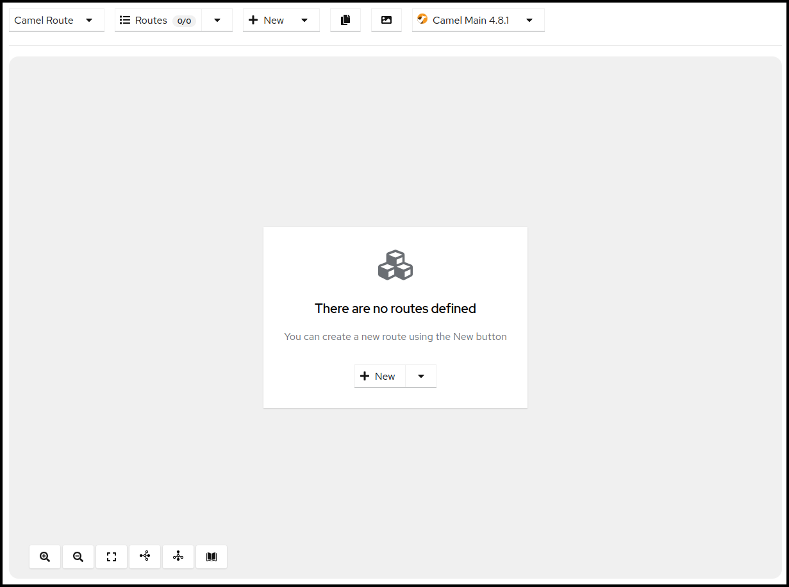
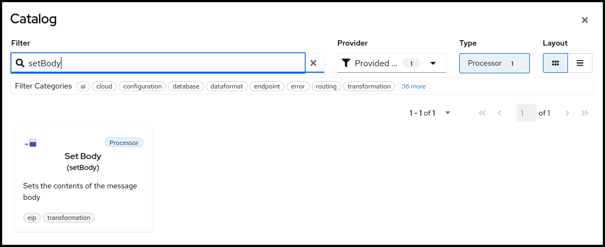

## Overview
Kaoto stands out as an intuitive visual platform for Apache Camel integrations, specifically designed to streamline the development process. It offers an accessible entry point for junior integration engineers through its low-code/no-code capabilities, making the initial steps of integration development straightforward. Moreover, Kaoto supports a seamless transition to more sophisticated features, allowing expert Camel developers to develop and fine-tune complex integration routes effectively.

The audience for this guide is Apache Camel developers. This guide assumes familiarity with Apache Camel and the processing requirements for your organization. 

Kaoto is an acronym for Kamel Orchestration Tool. It is a low code and no code integration designer to create and edit integrations based on Apache Camel. Kaoto is extendable, flexible, and adaptable to different use cases. For more information about the history of Kaoto, see Statistics and History of Kaoto.

Kaoto offers a rich catalog of building blocks for use in graphical design. By default, Kaoto loads the official upstream Camel Catalog and Kamelet Catalog. 

Benefits of using Kaoto can be listed as follows:

- **Enhanced Visual Development Experience**

  By leveraging Kaoto’s visual designing capabilities, users can intuitively create, view, and edit Camel integrations through the user interface. This low-code/no-code approach significantly reduces the learning curve for new users and accelerates the development process for seasoned developers.

- **Comprehensive Component Catalog Accessibility**

  Kaoto provides immediate access to a rich catalog of Camel components, enterprise integration patterns (EIPs), and Kamelets. This extensive Catalog enables developers to easily find and implement the necessary components for their integration solutions. By having these resources readily available, developers can focus more on solving business problems rather than spending time searching for and learning about different components.

- **Streamlined Integration Development Process**

  The platform is designed with an efficient user experience in mind, optimizing the steps required to create comprehensive integrations. This efficiency is achieved through features like auto-completion, configuration forms, and interactive feedback mechanisms. As a result, developers can quickly assemble and configure integrations, reducing the overall development time. This streamlined process encourages experimentation and innovation by making it easier to prototype and test different approaches. 

## Installation

### Requirements

#### Microsoft Visual Studio Code
Kaoto ships as a Microsoft Visual Studio Code extension. If you haven't installed VS Code on your manchine yet, please do that now.

Visit [the download page](https://code.visualstudio.com/docs/setup/setup-overview) and follow the installation instructions that apply best for you.

#### Camel CLI
To give you the best user experience we recommend to install the Camel CLI, which offers various functionalities for Camel developers.

Please follow the below steps to install it.

- Install [JBang](https://www.jbang.dev) following these [instructions](https://www.jbang.dev/download/)
- Verify that [JBang](https://www.jbang.dev) is working by executing the following from a command shell. This should output the version of installed [JBang](https://www.jbang.dev).

```bash
jbang version
```
- Run the following command from a command shell to install the [Camel CLI](https://camel.apache.org/manual/camel-jbang.html):

```bash
jbang app install camel@apache/camel
```
- Check if the [Camel CLI](https://camel.apache.org/manual/camel-jbang.html) is working by executing the following from a command shell. This should output the version of the installed [Camel CLI](https://camel.apache.org/manual/camel-jbang.html).

```bash
camel version
```

### Install Kaoto
{}
For the best user experience and for additional supportive features, we suggest installing the [Extension Pack for Apache Camel](https://marketplace.visualstudio.com/items?itemName=redhat.apache-camel-extension-pack), which also includes the Kaoto VS Code extension.
{}

- Open VS Code
- Open the <code>Extensions</code> view on the left side panel (or press <code>CTRL+SHIFT+X</code>)
- Type <code>Extension Pack for Apache Camel</code> in the search field
- Click the <code>Install</code> button



## Getting Started
This section describes how to 
- setup a workspace in VS Code
- access the important commands to create your integration
- create your first Camel Route
- run your Camel Route locally
- get access to the source code of the Camel Route

### Preparing the Workspace
Visual Studio Code requires you to create a workspace for your project to access the full functionality of the environment. If you haven't done so yet, please open your Visual Studio Code instance. You can do that by finding the right launcher on your computer or by opening a command shell and executing <code>code</code>. This should leave you with a window like the one below.


Next we need to select our workspace folder which will store our project files. Go to the <code>File</code> menu and select the entry <code>Open Folder</code>. In the following screen browse to the folder you would like to use and select it. 


### VS Code Commands
{}
Some VS Code commands require a workspace to show up and function correctly. If you haven't set one up and opened it you should check the [Preparing the Workspace](#preparing-the-workspace) section.
{}

To access the VS Code command palette you have to press either <code>F1</code> or <code>CTRL+SHIFT+P</code>. This will open up an entry field which you can use to filter for the commands you are interested in. 

In our case we are interested in the <code>Camel</code> related commands, so lets type <code>Camel</code> into the field and check the filtered results.


### Create your first Camel Route
If you followed the steps from the [](#vs-code-commands) section you should still see the filtered Camel commands. Please select now the command called <code>Camel: Create a Camel Route using YAML DSL</code> and hit <code>Enter</code>. Next you are asked to provide a name for the file to be created. Feel free to pick a name without stating a file extension (example: <code>simpleTest</code>) and hit <code>Enter</code> again.

{}
If the execution fails you should double check if you have installed the [Camel CLI](https://camel.apache.org/manual/camel-jbang.html) correctly. Follow the instructions outline in the section [Camel CLI](#camel-cli) section.
{}

If all worked correctly you should now see your new file with the extension <code>.camel.yaml</code> and the Kaoto Visual Designer should open up.
{}
If the Kaoto editor doesn't open check you followed the [Install Kaoto](#install-kaoto) section and your file is named like <code>_filename.camel.yaml_</code>. If you named the file differently then rename it to match this naming rule.
{}

You should now see a similar screen like the one below.



### Launch your Camel Route
The Camel Route we created in the [previous chapter](#create-your-first-camel-route) can already be launched. Let's try to start the Route by clicking the <code>Run Camel Application with JBang</code> button in the top right of the Kaoto Visual Editor.


A terminal should open up and it will show you the output of your launched Camel Route.


You can terminate the execution of your Camel Route at any time by selecting the terminal window and pressing <code>CTRL+C</code>.

### Accessing the Source Code
You might wonder how the source of your new Camel Route looks like. While Kaoto tries relief users from the burden of working with the source code, we still allow access to it via the default Visual Studio Code Text Editor. 

To access your source code you can either right click the tab labeled with the filename and then select <code>Reopen Editor with</code> and then choosing <code>Text Editor</code>.

Another way of doing that is to right-click the file in the Explorer view on the left side of the window and then similarly selecting the menu item <code>Open With</code> and then choosing <code>Text Editor</code>.

If you want to revert back to the Kaoto Editor you can follow the same steps as above but instead of <code>Text Editor</code> you should then select <code>Kaoto Editor</code>.

## The Visual Designer

### Overview
The following picture shows the different parts of the Kaoto Visual Editor.



1. The Explorer View with the opened file selected
2. The currently displayed Integration
3. The configuration panel where you can adjust and customize settings for the selected step
4. Drop down showing the currently selected integration type, here **Camel Route**
5. Drop down showing the currently selected Camel Route. This is handy if you have more than one Camel Route defined in your file. You can rename, delete, select and switch the visibility for each Camel Route here
6. Drop down enabling you to add more Routes or other global elements to your integration. **Only visible for Camel Routes!**
7. Copies the full source code of your integration to the Clipboard
8. Exports the currently visible Integration as a PNG image
9. This button bar provides you with functionalities like Zoom In / Out, Reset the View, Switching the layout direction between horizontal and vertical and grants you access to the comprehensive Camel Catalog, containing all the available Components/Connectors, Enterprise Integration Patterns and Kamelets
10. A step in your Integration with a **Warning**-Marker to indicate a problem with the configuration of the step.

### Working with Camel Routes
In [Apache Camel](https://camel.apache.org), a route is a set of processing steps that are applied to a message as it travels from a source to a destination. A route typically consists of a series of processing steps that are connected in a linear sequence.

A Camel Route is where the integration flow is defined. For example, you can write a Camel Route to specify how two systems can be integrated. You can also specify how the data can be manipulated, routed, or mediated between the systems.

#### Creating a new Camel Route
We already covered how to create a new Camel Route YAML file in the chapter [Create your first Camel Route](#create-your-first-camel-route). 

Let's use another way of creating a new Camel Route. If you have your route from the other chapter still open, click on the Route selection drop down and then delete all the routes using the trashbin icon.


Once you confirmed the deletion of all your routes you should see a blank screen like below.



You can now create a new Camel Route by either clicking the <code>+ New</code> button in the center of the canvas or by using the same button in the upper menu bar of the Canvas, next to the Route selection drop down, which will both put a template route in place which uses a **Timer** component to send every second a message to the **Log** component.

#### Adding a step
Now lets add a new step between the **Timer** and the **Log** component to modify the message body. There are two ways of adding a step to the route. You can either Right-Click on the step you want to insert or click the 3 dots on the right side of the steps label. This will bring up a context menu with the available actions to choose from. 

Right-Click the **Timer** step now.


{}
The set of available actions depend on the selected step and can vary. There are actions for appending, prepending, replacing and deleting steps as well as some more specialized actions.
{}

Lets now select the **+ Add step** action. This will open up the Camel Catalog where you can search the step you want to add. 


As already mentioned we would like to modify the message body before sending it along to the **Log** component. To achieve that we need to add a **Processor** called **setBody**. Let's enter this name into the filter text field on top of the Catalog.



You can now select the **setBody** tile to add it to your route. Select the new added step now on the canvas to open the configuration form to the right.


To modify the content of the message we have to define the **Expression**. Click on the pencil icon next to the field to open up the Expression Editor.


Let's change the **Expression** text field to <code>Hello from Kaoto!</code> and then hit **Apply**. 
Now the **Log** component will receive a <code>Hello from Kaoto!</code> message every second and logs it to the console.

{}
Adding steps is usually done with two actions. **Prepend** can be used to add a step _before_ the selected step and **Append** will add the new step _after_ the selected step.

However, on the first step of a flow and on steps that can have children, the **Add Step** action is used. 
{}

#### Replacing a step
You can replace any step on the canvas by invoking the context menu on a step and selecting the item **Replace**. This will open up the Camel Catalog and you can choose the replacement from there.

#### Deleting a step
{}
When invoking the **Delete** action on a step with children or on a container element containing children there will be a confirmation dialog because you are about to delete not just the single step or container but also all the contained children. **Be cautious**!
{}

You can delete any step on the canvas by invoking the context menu on a step and selecting the item **Delete**. This will remove the step from the route.

#### Enable / Disable a step
You can enable / disable any step in your route by invoking the context menu on a step and selecting the item **Enable / Disable**. This will instruct the [Apache Camel](https://camel.apache.org) runtime to ignore the step when executing the flow. This can be convenient when prototyping a new route. 


In the picture above the **Log** component has been disabled. The label of the step is striked through, the icon is grayed out and there is a marker icon at the top right of the step to indicate it is disabled.

<!-- TODO
### Working with Kamelets

### Working with Pipes

### How to define connections

### Using application.properties

## Advanced

### Debugging

### Working with OpenAPI

### Transform to Camel YAML DSL

### Creating a SpringBoot Application

### Creating a Quarkus Application
-->