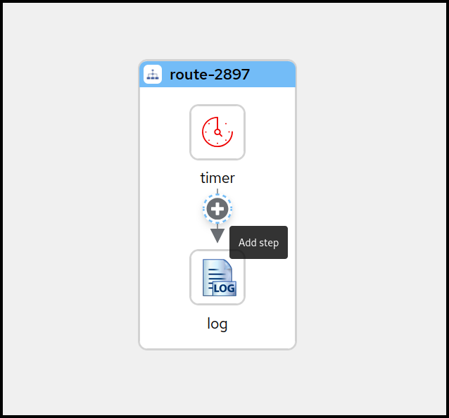

## Overview
Kaoto stands out as an intuitive visual platform for Apache Camel integrations, specifically designed to streamline the development process. It offers an accessible entry point for junior integration engineers through its low-code/no-code capabilities, making the initial steps of integration development straightforward. Moreover, Kaoto supports a seamless transition to more sophisticated features, allowing expert Camel developers to develop and fine-tune complex integration routes effectively.

The audience for this guide is Apache Camel developers. This guide assumes familiarity with Apache Camel and the processing requirements for your organization. 

Kaoto is an acronym for Kamel Orchestration Tool. It is a low code and no code integration designer to create and edit integrations based on Apache Camel. Kaoto is extendable, flexible, and adaptable to different use cases. For more information about the history of Kaoto, see Statistics and History of Kaoto.

Kaoto offers a rich catalog of building blocks for use in graphical design. By default, Kaoto loads the official upstream Camel Catalog and Kamelet Catalog. 

Benefits of using Kaoto can be listed as follows:

- **Enhanced Visual Development Experience**

  By leveraging Kaoto’s visual designing capabilities, users can intuitively create, view, and edit Camel integrations through the user interface. This low-code/no-code approach significantly reduces the learning curve for new users and accelerates the development process for seasoned developers.

- **Comprehensive Component Catalog Accessibility**

  Kaoto provides immediate access to a rich catalog of Camel components, enterprise integration patterns (EIPs), and Kamelets. This extensive Catalog enables developers to easily find and implement the necessary components for their integration solutions. By having these resources readily available, developers can focus more on solving business problems rather than spending time searching for and learning about different components.

- **Streamlined Integration Development Process**

  The platform is designed with an efficient user experience in mind, optimizing the steps required to create comprehensive integrations. This efficiency is achieved through features like auto-completion, configuration forms, and interactive feedback mechanisms. As a result, developers can quickly assemble and configure integrations, reducing the overall development time. This streamlined process encourages experimentation and innovation by making it easier to prototype and test different approaches. 

## Installation

### Requirements

#### Microsoft Visual Studio Code
Kaoto ships as a Microsoft Visual Studio Code extension. If you haven't installed VS Code on your manchine yet, please do that now.

Visit [the download page](https://code.visualstudio.com/docs/setup/setup-overview) and follow the installation instructions that apply best for you.

#### Camel CLI
To give you the best user experience we recommend to install the Camel CLI, which offers various functionalities for Camel developers.

Please follow the below steps to install it.

- Install [JBang](https://www.jbang.dev) following these [instructions](https://www.jbang.dev/download/)
- Verify that [JBang](https://www.jbang.dev) is working by executing the following from a command shell. This should output the version of installed [JBang](https://www.jbang.dev).

```bash
jbang version
```
- Run the following command from a command shell to install the [Camel CLI](https://camel.apache.org/manual/camel-jbang.html):

```bash
jbang app install camel@apache/camel
```
- Check if the [Camel CLI](https://camel.apache.org/manual/camel-jbang.html) is working by executing the following from a command shell. This should output the version of the installed [Camel CLI](https://camel.apache.org/manual/camel-jbang.html).

```bash
camel version
```

#### Citrus Testing
If you want to work with the Citrus testing framework, we strongly recommend to install the Citrus JBang plugin.

Please follow the below steps to install it.

- Install [JBang](https://www.jbang.dev) following these [instructions](https://www.jbang.dev/download/)
- Verify that [JBang](https://www.jbang.dev) is working by executing the following from a command shell. This should output the version of installed [JBang](https://www.jbang.dev).

```bash
jbang version
```
- Run the following command from a command shell to install the [Citrus JBang plugin](https://github.com/apache/camel-jbang-examples?tab=readme-ov-file#integration-testing):

```bash
jbang app install citrus@citrusframework/citrus
```
- Check if the [Citrus JBang plugin](https://github.com/apache/camel-jbang-examples?tab=readme-ov-file#integration-testing) is working by executing the following from a command shell. This should output the version of the installed [Citrus JBang plugin](https://github.com/apache/camel-jbang-examples?tab=readme-ov-file#integration-testing).

```bash
citrus --version
```

### Install Kaoto
{}
For the best user experience and for additional supportive features, we suggest installing the [Extension Pack for Apache Camel](https://marketplace.visualstudio.com/items?itemName=redhat.apache-camel-extension-pack), which also includes the Kaoto VS Code extension.
{}

- Open VS Code
- Open the <code>Extensions</code> view on the left side panel (or press <code>CTRL+SHIFT+X</code>)
- Type <code>Extension Pack for Apache Camel</code> in the search field
- Click the <code>Install</code> button


## Getting Started
This section describes how to 
- setup a workspace in VS Code
- access the important commands to create your integration
- create your first Camel Route
- run your Camel Route locally
- get access to the source code of the Camel Route

### Preparing the Workspace
Visual Studio Code requires you to create a workspace for your project to access the full functionality of the environment. If you haven't done so yet, please open your Visual Studio Code instance. You can do that by finding the right launcher on your computer or by opening a command shell and executing <code>code</code>. This should leave you with a window like the one below.


Next we need to select our workspace folder which will store our project files. Go to the <code>File</code> menu and select the entry <code>Open Folder</code>. In the following screen browse to the folder you would like to use and select it. 


### VS Code Commands
{}
Some VS Code commands require a workspace to show up and function correctly. If you haven't set one up and opened it you should check the [Preparing the Workspace](#preparing-the-workspace) section.
{}

To access the VS Code command palette you have to press either <code>F1</code> or <code>CTRL+SHIFT+P</code>. This will open up an entry field which you can use to filter for the commands you are interested in. 

In our case we are interested in the <code>Camel</code> related commands, so lets type <code>Camel</code> into the field and check the filtered results.


### Create your first Camel Route
If you followed the steps from the [](#vs-code-commands) section you should still see the filtered Camel commands. Please select now the command called <code>Camel: Create a Camel Route using YAML DSL</code> and hit <code>Enter</code>. Next you are asked to provide a name for the file to be created. Feel free to pick a name without stating a file extension (example: <code>simpleTest</code>) and hit <code>Enter</code> again.

{}
If the execution fails you should double check if you have installed the [Camel CLI](https://camel.apache.org/manual/camel-jbang.html) correctly. Follow the instructions outline in the section [Camel CLI](#camel-cli) section.
{}

If all worked correctly you should now see your new file with the extension <code>.camel.yaml</code> and the Kaoto Visual Designer should open up.
{}
If the Kaoto editor doesn't open check you followed the [Install Kaoto](#install-kaoto) section and your file is named like <code>_filename.camel.yaml_</code>. If you named the file differently then rename it to match this naming rule.
{}

You should now see a similar screen like the one below.


### Launch your Camel Route
The Camel Route we created in the [previous chapter](#create-your-first-camel-route) can already be launched. Let's try to start the Route by clicking the <code>Run Camel Application with JBang</code> button in the top right of the Kaoto Visual Editor.


A terminal should open up and it will show you the output of your launched Camel Route.


You can terminate the execution of your Camel Route at any time by selecting the terminal window and pressing <code>CTRL+C</code>.

### Accessing the Source Code
You might wonder how the source of your new Camel Route looks like. While Kaoto tries relief users from the burden of working with the source code, we still allow access to it via the default Visual Studio Code Text Editor. 

To access your source code you can either right click the tab labeled with the filename and then select <code>Reopen Editor with</code> and then choosing <code>Text Editor</code>.

Another way of doing that is to right-click the file in the Explorer view on the left side of the window and then similarly selecting the menu item <code>Open With</code> and then choosing <code>Text Editor</code>.

If you want to revert back to the Kaoto Editor you can follow the same steps as above but instead of <code>Text Editor</code> you should then select <code>Kaoto Editor</code>.

## The Visual Designer

### Overview
The following picture shows the different parts of the Kaoto Visual Editor.


1. The Explorer View with the opened file selected
2. The currently displayed Integration
3. The configuration panel where you can adjust and customize settings for the selected step
4. Drop down showing the currently selected integration type, here **Camel Route**
5. Drop down showing the currently selected Camel Route. This is handy if you have more than one Camel Route defined in your file. You can rename, delete, select and switch the visibility for each Camel Route here
6. Drop down enabling you to add more Routes or other global elements to your integration. **Only visible for Camel Routes!**
7. Copies the full source code of your integration to the Clipboard
8. Exports the currently visible Integration as a PNG image
9. Drop down showing the available Camel versions. Different runtimes are available, like Camel Main, Springboot and Quarkus.
10. This button bar provides you with functionalities like Zoom In / Out, Reset the View, Switching the layout direction between horizontal and vertical and grants you access to the comprehensive Camel Catalog, containing all the available Components/Connectors, Enterprise Integration Patterns and Kamelets
11. A step in your Integration with an **Error**-Marker to indicate a problem with the configuration of the step.
12. The toolbar of the selected step. It provides available actions for the current selection.

### Working with Camel Routes
In [Apache Camel](https://camel.apache.org), a route is a set of processing steps that are applied to a message as it travels from a source to a destination. A route typically consists of a series of processing steps that are connected in a linear sequence.

A Camel Route is where the integration flow is defined. For example, you can write a Camel Route to specify how two systems can be integrated. You can also specify how the data can be manipulated, routed, or mediated between the systems.

#### Creating a new Camel Route
We already covered how to create a new Camel Route YAML file in the chapter [Create your first Camel Route](#create-your-first-camel-route). 

Let's use another way of creating a new Camel Route. If you have your route from the other chapter still open, click on the Route selection drop down and then delete all the routes using the trashbin icon.


Once you confirmed the deletion of all your routes you should see a blank screen like below.


You can now create a new Camel Route by either clicking the <code>+ New</code> button in the center of the canvas or by using the same button in the upper menu bar of the Canvas, next to the Route selection drop down, which will both put a template route in place which uses a **Timer** component to send every second a message to the **Log** component.

#### Adding a step
Now lets add a new step between the **Timer** and the **Log** component to modify the message body. There are two ways of adding a step to the route. You can either Right-Click on the step you want to insert before or after. This will bring up a context menu with the available actions to choose from. An easier alternative would be to hover over the connection between the two steps you want to insert between and then click on the **+** button that appears. 

Hover over the connection between the **Timer** and the **Log** steps now and click the **+** button to execute the **Add step** action.



{}
When using the right-click context menu, the set of available actions depend on the selected step and can vary. There are actions for appending, prepending, replacing and deleting steps as well as some more specialized actions.
{}

This will open up the Camel Catalog where you can search the step you want to add.


As already mentioned we would like to modify the message body before sending it along to the **Log** component. To achieve that we need to add a **Processor** called **setBody**. Let's enter this name into the filter text field on top of the Catalog.


You can now select the **setBody** tile to add it to your route. Select the new added step now on the canvas to open the configuration form to the right.


Let's change the **Expression** text field to <code>Hello from Kaoto!</code>. 

Now the **Log** component will receive a <code>Hello from Kaoto!</code> message every second and logs it to the console.

{}
When using the right click context menu of a step, adding new steps is usually done with two actions. **Prepend** can be used to add a step _before_ the selected step and **Append** will add the new step _after_ the selected step.

However, on the first step of a flow and on steps that can have children, the **Add Step** action is used. 
{}

#### Replacing a step
You can replace any step on the canvas by hovering over or by selecting the step. This will spawn a toolbar which contains a button for the Replace action.


Alternatively you can do that also by invoking the context menu on a step and selecting the item **Replace**. 
Both ways it will open up the Camel Catalog and you can choose the replacement from there.

#### Deleting a step
{}
When invoking the **Delete** action on a step with children or on a container element containing children there will be a confirmation dialog because you are about to delete not just the single step or container but also all the contained children. **Be cautious**!
{}

You can delete any step on the canvas by hovering over or by selecting the step. This will spawn a toolbar which contains a button for the Delete action.


Alternatively you can do that also by invoking the context menu on a step and selecting the item **Delete**. This will remove the step from your integration.

#### Enable / Disable a step
You can enable or disable any step on the canvas by hovering over or by selecting the step. This will spawn a toolbar which contains a button for the Enable / Disable action.

{}
Disabling a step will instruct the [Apache Camel](https://camel.apache.org) runtime to ignore the step when executing the flow. This can be convenient when prototyping a new route.
{}


Alternatively you can enable / disable any step in your route by invoking the context menu on a step and selecting the item **Enable / Disable**.  


In the picture above the **Log** component has been disabled. The icon is grayed out and there is a marker icon at the top right of the step to indicate it is disabled.

### Kaoto DataMapper (technical preview)
> [!NOTE]
> Currently Kaoto DataMapper is supported only inside the Kaoto Visual Studio Code extension. In the future release, standalone web version of Kaoto will also support configuring the DataMapper step.

> [!NOTE]
> As an initial technical preview version, Kaoto DataMapper only supports XML schema for rendering the data structure. And it internally generates a single XSLT step to perform configured data mappings at runtime. While you can consume multiple XML documents with using Camel Variables and/or Message Headers that are mapped to XSLT Parameters, the output is only a Camel Message Body.

In addition to the regular Camel steps, Kaoto supports **Kaoto DataMapper (technical preview)** step to be placed in the Camel Route. Kaoto DataMapper step provides a graphical user interface to create data mappings inside the Camel Route.

#### Adding a DataMapper step
1. Add a **Kaoto DataMapper** step in your Camel route. When you `Append`, `Prepend` or `Replace` a step in the Kaoto Design view, you can find the **Kaoto DataMapper** step in the catalog.

| Tile view                            | List view                            |
|--------------------------------------|--------------------------------------|
|  |  |

2. Click the added **Kaoto DataMapper** step in the Kaoto Design view. It opens up Kaoto DataMapper config form.


3. In the Kaoto DataMapper config form, click `Configure` button.


4. The blank Kaoto DataMapper canvas will launch.


#### Source and Target
In the DataMapper canvas, you can see `Source` at the left and `Target` at the right.


The `Source` is in an other word input, which the DataMapper step reads the data from. This is mapped to the incoming Camel `Message` to the DataMapper step, as well as Camel `Variables`.
 
The `Target` is in an other word output, which the DataMapper step writes the data to.
This is mapped to the outgoing Camel `Message` from the DataMapper step.

#### Parameters

The `Parameters` inside the `Source` is mapped to any of incoming Camel `Variables` and `Message Headers`. For example, if there is an incoming Camel Variable `orderSequence`, you can consume it by adding a Parameter `orderSequence` in the DataMapper Source/Parameters section.

To add a parameter,
1. Click the plus (+) button on `Parameters` panel


2. Type parameter name and click the check button


> [!NOTE]
> While Camel Exchange Properties are also mapped to Parameters in current camel-xslt-saxon implementation, after the [Camel Variables](https://camel.apache.org/manual/variables.html) has been introduced, it is no longer recommended to store application data into Camel Exchange Properties. We encourage to use Variables instead.

#### Attaching Document schema files
If any of `Source Body`, `Target Body` and/or `Parameter(s)` are structured data, you can attach the schema file and visualize the data structure in a tree style view. If the data is not structured and just a primitive value, you don't need to attach a schema file.

To attach a schema,
1. Place schema file(s) inside the workspace directory

2. Click `Attach a schema` button

| Source Body | Target Body | Parameter |
|----------------------|----------------------|----------------------|
|  |  |  |

3. Select the schema file to attach


4. Document structure is rendered


#### Creating simple mappings
##### Creating a mapping by drag and drop a field
When you perform drag and drop between source and target, mapping is created and the line is drawn


##### Creating a mapping by typing xpath expression
You can also create a mapping by typing xpath expression directly.

1. Click the 3 dots context menu and select `Add selector expression`


2. Type the xpath expression


#### Creating conditional mappings
DataMapper supports creating 3 types of conditional mappings:
- `if` : The mapping is created only when the condition is satisfied
- `choose-when-otherwise` : The mapping is created following how condition is satisfied, where if `when` branch condition is satisfied, the `when` branch mapping is created. If no `when` branch condition is satisfied, then `otherwise` branch mapping is created.   
- `for-each` : The mapping is created for each collection items. The collection here means multiple occurrences, which is often represented as an array.

##### Creating an `if` mapping
1. On the target field to create a mapping, click the 3 dots context menu and select `wrap with "if"`


2. Configure `if` condition. You can drag the source field and drop into the input field and build the condition out of it, or type everything.


3. Configure the mapping. Similarly drag and drop or type.


##### Creating a `choose-when-otherwise` mapping
1. On the target field to create a mapping, click the 3 dots context menu and select `wrap with "choose-when-otherwise"`


2. Configure `when` condition


3. Configure the mapping for `when` branch


4. Configure the mapping for `otherwise` branch


5. If needed, you can add one or more `when` branch. On the `choose` field at the Target side, click the 3 dots context menu and select `Add "when"`


##### Creating a `for-each` mapping
When a field is a collection field, which means it could have multiple occurrences, IOW it's a repeating element which is often represented as an array, you can create a `for-each` mapping. The layer icon on the field indicates that it's a collection field.


1. On the target collection field to create a `for-each` mapping, click the 3 dots context menu and select `wrap with "for-each"`


2. Configure `for-each` condition by specifying the source collection field to iterate over 


3. Configure the mappings below. Note that the mapping field path is now a relative path from the collection field specified on `for-each` condition


#### Using XPath expression editor

> [!NOTE]
> XPath editor is still under initial development and it currently supports limited drag and drop. In the future releases, more syntax assisting features will be added.

When you want to write something more in XPath expression than just a field path, you can launch the XPath expression editor and work on it. There is a pencil icon on the target field which launches the XPath expression editor when you click.

1. On the target field which has a mapping, click the pencil button


2. XPath editor launches


3. You can type in the editor at the right, or drag a field and drop onto the editor


4. You can also drag and drop XPath functions. Click `Function` tab at left side


5. And drag the function and drop onto the editor


6. When it's done, click the `Close` button at the bottom left


7. Now you can see the mapping is created in the tree view


### Deleting a mapping
1. On the target field in the mapping, click the trash button


2. Click confirm


3. Mapping is deleted


### Deleting a parameter

1. To delete a parameter, click the trash button on the parameter


2. Click `Confirm` in the dialog


3. The parameter is deleted


### Detaching a schema
If you have a Document you already attached a schema and made it structured, but you want to turn it back to be a primitive value and unstructured, you can detach the schema from the Document.

1. Click a `Detach schema` button


2. Click a `confirm` button


3. Now the Document got back to be a primitive value 


#### Example Data Mappings


#### Built-in instructions

When you don’t yet have an active DataMapper canvas opened, if you click the DataMapper tab, it shows the built-in step-by-step instructions of how to use Kaoto DataMapper UI.


<!-- TODO
### Working with Kamelets

### Working with Pipes

### How to define connections

### Using application.properties

## Advanced

### Debugging

### Working with OpenAPI

### Transform to Camel YAML DSL

### Creating a SpringBoot Application

### Creating a Quarkus Application
-->