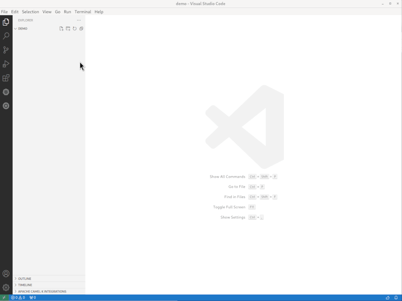
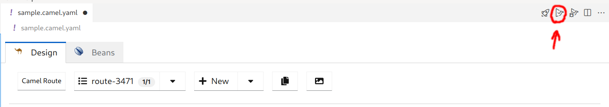
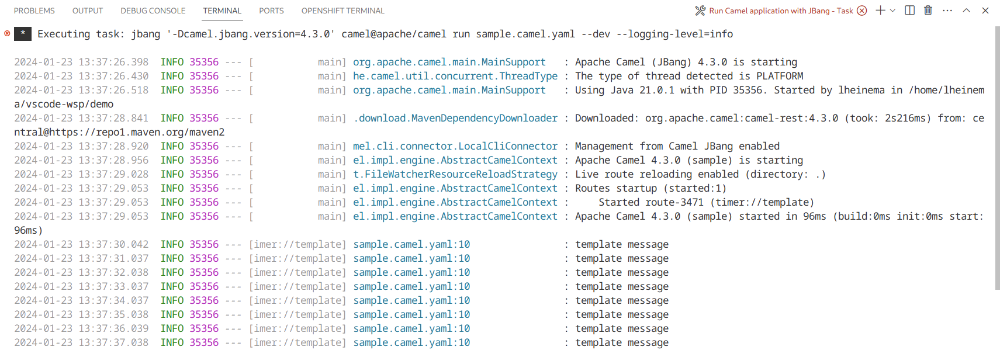

On this guide you will learn how to create your first route using Kaoto in a no-code way. This means, you will not write any source code at this point.

## Getting Kaoto

The first step is to install the Kaoto VS Code extension. Follow the [Installation Guide](/docs/installation) to find out more about how to do it. Once done with the installation tasks you should launch VS Code. Make sure you have created and selected a workspace folder where your integration will be stored. If you did not select a workspace, many commands will not show up as expected or behave differently.

## Create a new Camel Route

First of all we have to create a new file which will store our integration. In the `Explorer` view on the left side of the screen you can find a small file icon with a plus sign on it. If you click on it you can enter a file name. Please make sure you are using the file suffix  `.camel.yaml`. This will ensure you get the support of the language completion features and more.

Once you hit `Enter`, the new file is created and the Kaoto editor should show up like in the image below. If it doesn't show up you might need to revisit the earlier steps and check if you followed all the instructions. 

Now we want to make sure we are going to build an Camel Route. Click on the `+ New` button and select the `Camel Route` option as shown above. This will leave you with a prefilled Camel Route example which periodically sends messages to a log endpoint.

At this point you already have your first working Camel Route which can be tested right away.

## Running the Camel Route

If you have installed the [Extension Pack for Apache Camel](https://marketplace.visualstudio.com/items?itemName=redhat.apache-camel-extension-pack) when following the [Installation Guide](/docs/installation), you should see a few small icons on the top right of the Kaoto editor. (see image below)

The icon marked with red color lets you run your route locally using [Camel JBang](https://camel.apache.org/manual/camel-jbang.html). If you click the button it should spawn output as shown in the below picture, periodically spawning new messages. 

If you get an error message instead, please make sure to install [Camel JBang](https://camel.apache.org/manual/camel-jbang.html).

Once you are done watching your new route write messages to the console, you can then stop the execution by selecting the `Terminal` output with your mouse and then pressing `CTRL+C`. This will stop the execution.