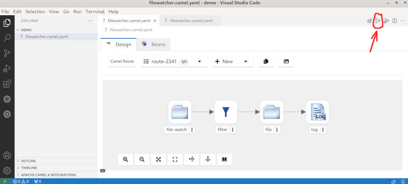
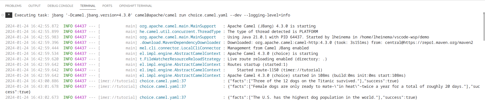

## 1 - Create a choice 

The goals for this exercise are:

 - Create a new Camel route and let it start with a `timer` step, which will be named `tutorial`
 - Then we set the body of the message (`setBody`) to a random `0` or `1` value
 - The third step will be a `choice` step with a `when` and an `otherwise` branch

    - The `when` branch should be executed if the body of the message is `1`
    - The `otherwise` branch acts as the fallback and will automatically cover the case when the message body is `0` or actually anything else than `1`
 - Finally we will add a `log` step to each of the branches
    
    - For the `1` case we will output `"We got a one!"` 
    - For the fallback we will print the message body with `"We got a ${body}"`

### Hints

 - To configure a step and fill the configuration properties, click on the step icon
 - You can generate random numbers using the simple expression language function [random](https://camel.apache.org/components/4.0.x/languages/simple-language.html)
 - The simple expression `${random(2)}` will generate a random number between zero (included) and two (not included)
 - When configuring the `setBody`, you can use the expression language `Simple` and then the `expression` used will be `${random(2)}`
 - We have to fill the condition `${body} == 1` in the `when`
 - We add a `log` step into a branch using the `Insert into` context menu on the `when` and `otherwise` steps
 - Kaoto offers two `log` steps to add: the camel component and the processor. For simplicity, we will choose the processor 
 - The `log` has a property `message` which we need to fill as described in the goals

### Solution

The following video showcases the solution.



At this point, the source editor should show something similar to the following code:

```yaml
- route:
    id: route-1150
    from:
      id: from-2530
      uri: timer
      parameters:
        period: "1000"
        timerName: tutorial
      steps:
        - setBody:
            id: setBody-3478
            expression:
              simple:
                expression: ${random(2)}
        - choice:
            id: choice-2937
            when:
              - id: when-2316
                steps:
                  - log:
                      id: log-5995
                      message: We got a one!
                expression:
                  simple:
                    expression: ${body} == 1
            otherwise:
              id: otherwise-2904
              steps:
                - log:
                    id: log-2668
                    message: We got a ${body}
```

If it doesn't look like that but you still want to go to the following exercise, you can copy and paste that code to your source editor and save the changes. This will update the design editor as well.

## 2 - Set Header instead of Body

In this exercise we are going to modify the previously created route to replace the `setBody` with a `setHeader`. 

The goal for this exercise is:

 - Modify the route so instead of setting the body, we will use a header called `myChoice` for the decision.

### Hints

 - To replace an existing component, right click on it and choose the `Replace` menu item
 - Watch out because there are two very similar written processors. Do not use the `setHeaders` processor.
 
### Solution

The following video showcases the solution.



At this point, the source editor should show the following code:

```yaml
- route:
    id: route-1150
    from:
      id: from-2530
      uri: timer
      parameters:
        period: "1000"
        timerName: tutorial
      steps:
        - setHeader:
            id: setHeader-3233
            expression:
              simple:
                expression: ${random(2)}
            name: myChoice
        - choice:
            id: choice-2937
            when:
              - id: when-2316
                steps:
                  - log:
                      id: log-5995
                      message: We got a one!
                expression:
                  simple:
                    expression: ${header.myChoice} == 1
            otherwise:
              id: otherwise-2904
              steps:
                - log:
                    id: log-2668
                    message: We got a ${body}
```

If it doesn't look like that but you still want to go to the following exercise, you can copy and paste that code to your source editor and save the changes. This will update the design editor as well.

## 3 - Connect to an external service

In this exercise we are going to modify the previously created route to add calls to external APIs in the `when` and `otherwise` branches.

The goals for this exercise are:

 - Modify the route so when the generated random number is `0` it calls the service `https://dog-api.kinduff.com/api/facts` to display a random dog fact on the log
 - Modify the route so when the generated random number is `1` it calls the service `https://cat-fact.herokuapp.com/facts/random` to display a random cat fact on the log
 - Only use a single `log` at the end of the route
 - Change the log to just display the `${body}` of the message

Note: these two services are testing services that we don't control. Make sure they run properly before attempting to use them to prevent any weird errors.

### Hints

 - To call an external service, you can use the `https` component.
 - You just need to configure the `HTTP Uri` with the proper value.
 - To remove a step from a flow branch, there is a `-` button that appears when you hover over the step.
 - You can add steps after the `choice` by clicking on the `+` button near it.
 
### Solution

The following video showcases the solution.



At this point, the source editor should show the following code:

```yaml
- route:
    id: route-1150
    from:
      id: from-2530
      uri: timer
      parameters:
        period: "1000"
        timerName: tutorial
      steps:
        - setHeader:
            id: setHeader-3234
            expression:
              simple:
                expression: ${random(2)}
            name: myChoice
        - choice:
            id: choice-2937
            when:
              - id: when-2316
                steps:
                  - to:
                      id: to-1376
                      uri: https
                      parameters:
                        httpUri: https://cat-fact.herokuapp.com/facts/random
                expression:
                  simple:
                    expression: ${header.myChoice} == 1
            otherwise:
              id: otherwise-2904
              steps:
                - to:
                    id: to-2860
                    uri: https
                    parameters:
                      httpUri: https://dog-api.kinduff.com/api/facts
        - log:
            id: log-2479
            message: ${body}
```

If it doesn't look like that but you still want to go to the following exercise, you can copy and paste that code to your source editor and save the changes. This will update the design editor as well.

## 4 - Testing your route

So after we finished setting up our little Camel route it would be great if we could test it locally, right? Ok, then let's do that now!

Maybe you already discovered the little buttons on the top right of the Kaoto editor. You can hover over them to know more about what they are doing. In the picture below the launch button has been marked with red coloring.



Click this button now and watch what happens. If everything goes well you should see a similar output as in the image below.



If you see something different and maybe errors, please check the `Hints` section below.

### Hints
- Please make sure that you have saved your route before running it.
- Make sure you installed the [Extension Pack for Apache Camel](https://marketplace.visualstudio.com/items?itemName=redhat.apache-camel-extension-pack) as this will add buttons for easy access to launch / debug functionality. Also ensure you have installed [Camel JBang](https://camel.apache.org/manual/camel-jbang.html), otherwise the launch will throw errors. (see [Installation Guide](/docs/installation))
- This integration will work better when running it locally, as the folder must be on the same machine when it gets executed.

### Solution

The following video showcases the solution.



## More information

More information about Apache Camel routes can be found on [the Apache Camel website](https://camel.apache.org/components/4.0.x/others/yaml-dsl.html)
