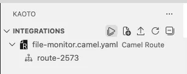
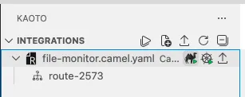

## Introduction

In this hands-on workshop, you will build a file monitoring integration using **Kaoto's visual designer** and **Apache Camel**. You'll learn how to watch a directory for file system changes, filter events based on conditions, and automatically back up files when they are created.

**What You'll Learn:**
- File system monitoring with the `file-watch` component
- Extracting metadata from Camel message headers
- Filtering events using the Message Filter pattern
- Copying files to backup locations
- Testing and debugging Camel routes locally
- Using Apache Camel's Simple Expression Language

**What You'll Build:**
A Camel route that monitors a directory for file changes, filters CREATE events, backs up newly created files to a separate directory, and logs all file system events to the console.

## Prerequisites

Before starting this workshop, ensure you have the following installed and configured on your system:

### Required Software

- **Visual Studio Code** - Download from [code.visualstudio.com](https://code.visualstudio.com/)
- **Kaoto Extension for VSCode** - Install from the [VSCode Marketplace](https://kaoto.io/docs/installation/)
<!-- - **Extension Pack for Apache Camel** - Provides launch/debug buttons
  - Install from [VSCode Marketplace](https://marketplace.visualstudio.com/items?itemName=redhat.apache-camel-extension-pack) -->
-- **Java Development Kit (JDK) 17 or later** - Required for running Apache Camel
  - Download from [Adoptium](https://adoptium.net/) or your preferred JDK distribution
- **Apache Camel JBang** (Optional but recommended) - For easy infrastructure setup
  - Install via: `curl -Ls https://sh.jbang.dev | bash -s - trust add https://github.com/apache/camel`
  - Then: `jbang app install camel@apache/camel`

### Required Knowledge

This workshop assumes you have:

- **Basic understanding of integration concepts** - Familiarity with data processing
- **Basic command-line skills** - Ability to navigate directories and run commands
- **Familiarity with VSCode** - Basic navigation and file management

### What You'll Set Up During the Workshop

The following will be configured as part of the workshop steps:

- Test directories for file monitoring
- Backup directory for file copies
- Camel integration route

> [!TIP]
> If you're new to Kaoto or Apache Camel, this beginner workshop is the perfect starting point. It introduces core concepts progressively.

## Project Setup

1. Install the [Kaoto extension for VSCode](https://kaoto.io/docs/installation/).
2. Create a new directory for the workshop:

```bash
$ mkdir file-monitor-workshop
$ cd file-monitor-workshop
```

3. Create the test directories:

```bash
$ mkdir -p /tmp/tutorial
$ mkdir -p /tmp/backup
```

> [!NOTE]
> These directories must exist before running the integration. The route will monitor `/tmp/tutorial/` and back up files to `/tmp/backup/`.

## Description

This workshop guides you through building a file monitoring integration using **Apache Camel** and **Kaoto**. You will create a route that demonstrates the **File Integration Pattern** and **Message Filter Pattern**, two fundamental Enterprise Integration Patterns (EIPs).

**The Route Flow:**

```
File System Events → File Watch → Filter (CREATE only) → Copy to Backup
                                                       ↓
                                                    Log All Events
```

The route continuously monitors a directory, processes each file system event, filters for CREATE events to trigger backups, and logs all events for visibility.

## Part 1: Log Changes

### Goal

Create a route that watches a folder and logs file system events (CREATE, MODIFY, DELETE) with detailed information about each change.

### Step-by-Step Instructions

#### Step 1: Create a New Route

1. Open VSCode and navigate to your `file-monitor-workshop` directory
2. Click the **Kaoto** icon in the left sidebar
3. Click the **Camel File...** button to create a new integration


4. If the previous **Camel File...** button is not showing, click on the second icon next to **Integrations** (a file with a + sign).

5. In the dialog that appears:
   - Select **Camel Route** as the file type
   - Select **YAML** as the Camel DSL
   - Choose your workshop folder as the saving location
   - Name the file `file-monitor`

A new route will appear in the Kaoto visual designer with a default timer component.

6. Select Camel Main 4.16.0 from the options that appear when clicking the Camel version. Other options present some variations related to the versions releases that may differ in some of the components presentation.


#### Step 2: Configure the File Watcher

The first component needs to monitor the test directory for file changes.

1. **Hover** over the timer component in the visual designer
2. Click the **Replace** icon (circular arrow) that appears
3. In the search box, type `file-watch` and select the **File Watch** component
4. Click on the File Watch component to open its properties panel on the right
5. Navigate to the **All** tab at the top of the properties panel
6. Configure the following properties:

   | Property | Value | What it does |
   |----------|-------|--------------|
   | **path** | `/tmp/tutorial/` | Directory to monitor for changes |
   | **recursive** | `false` | Don't watch subdirectories |

7. **Save** with the keyboard command `CTRL/CMD` + `S` or click in **File** (VS Code menu bar top left) and click on **Save**

> [!IMPORTANT]
> Use the `file-watch` component, not the `file` component. The `file-watch` component monitors for file system events, while `file` is for reading file contents.

#### Step 3: Add Log Processor

Now we'll add a log step to output information about detected changes.

1. **Hover** over the second component (SetBody) in the route
2. Click the **Delete** icon
3. Click on the Log processor to open its properties
4. Navigate to the **All** tab
5. Configure the message property:

   | Property | Value |
   |----------|-------|
   | **message** | `Detected  ${header.CamelFileEventType} on file ${header.CamelFileName} at ${header.CamelFileLastModified}` |

6. **Save** the changes

> **💡 Understanding Camel Headers:** The `file-watch` component populates message headers with metadata about file events:
> - `CamelFileEventType`: Type of event (CREATE, MODIFY, DELETE)
> - `CamelFileName`: Name of the affected file
> - `CamelFileLastModified`: Timestamp of last modification

#### Step 4: Review Your Route

Your completed route should look like this in the visual designer. The YAML source should be similar to:

```yaml
- route:
    id: route-2341
    from:
      id: from-2542
      uri: file-watch
      parameters:
        path: /tmp/tutorial/
        recursive: false
      steps:
        - log:
            id: log-4286
            message: Detected  ${header.CamelFileEventType} on file ${header.CamelFileName}
              at ${header.CamelFileLastModified}
```

> [!TIP]
> If your YAML doesn't match exactly, you can copy and paste this code into the source editor. Kaoto will automatically update the visual designer.

**✅ Checkpoint:** You've completed Part 1! The route will now monitor the folder and log all file system events.

---

## Part 2: Add a Filter

### Goal

Enhance the route to filter events and only back up files when they are created (not modified or deleted). This introduces the **Message Filter Pattern**.

### Step-by-Step Instructions

#### Step 1: Add Filter Processor

We'll insert a filter between the file-watch and log components.

1. **Hover** over the arrow between file-watch and log
2. Click the **+** icon that appears on the arrow
3. Search for `filter` and select the **Filter** processor
4. Click on the Filter component to open its properties
5. Navigate to the **All** tab
6. Configure the filter expression:

   | Property | Value | What it does |
   |----------|-------|--------------|
   | **Expression language** | **Simple** | The expression language to use |
   | **Expression** | `${header.CamelFileEventType} == 'CREATE'` | Condition to evaluate |

7. **Save** the changes

> **💡 Understanding the Filter:** The filter creates a conditional branch. Steps inside the filter only execute when the condition is true. In this case, only CREATE events will pass through.

#### Step 2: Add File Component Inside Filter

Now we'll add a file component inside the filter to copy created files.

1. Click **inside the filter placeholder** (the dotted box area)
2. This will add a new component inside the filter branch
3. Search for `file` and select the **File** component
4. Click on the File component to open its properties
5. Navigate to the **All** tab
6. Configure:

   | Property | Value | What it does |
   |----------|-------|--------------|
   | **directoryName** | `/tmp/backup/` | Destination folder for file copies |

7. **Save** the changes

> [!IMPORTANT]
> The file component must be placed **inside** the filter. Use the "Insert into" context menu or click inside the filter placeholder to ensure proper nesting.

#### Step 3: Review Your Route

Your completed route should look like this in the visual designer. The YAML source should be similar to:

```yaml
- route:
    id: route-2341
    from:
      id: from-2542
      uri: file-watch
      parameters:
        path: /tmp/tutorial/
        recursive: false
      steps:
        - filter:
            id: filter-1643
            steps:
              - to:
                  id: to-2886
                  uri: file
                  parameters:
                    directoryName: /tmp/backup/
            expression:
              simple:
                expression: ${header.CamelFileEventType} == 'CREATE'
        - log:
            id: log-4286
            message: Detected  ${header.CamelFileEventType} on file ${header.CamelFileName}
              at ${header.CamelFileLastModified}
```

**✅ Checkpoint:** You've completed Part 2! The route now backs up files only when they are created, while still logging all events.

---

## Part 3: Testing Your Route

### Goal

Launch the route locally and verify it works correctly by creating, modifying, and deleting test files.

### Step-by-Step Instructions

#### Step 1: Launch the Route

1. In the VSCode file explorer, locate your `file-monitor-workshop` folder
2. In the Kaoto extension panel, find the folder containing your YAML route file
3. Click the **Play** button (▶️) next to Integrations or next to the folder name




4. A new terminal will open in VSCode
5. Watch the terminal output as Camel JBang starts the route

You should see output similar to:

```
INFO  [route-2341] Apache Camel started
INFO  [route-2341] Monitoring /tmp/tutorial/ for file changes...
```

> **💡 What's happening:** The Kaoto extension uses Camel JBang to run your route locally, making it easy to test without complex setup.

#### Step 2: Test the Integration

With the route running, test it by creating files in the monitored directory:

1. Open a new terminal window
2. Create a test file:

```bash
$ echo "test content" > /tmp/tutorial/test1.txt
```

3. Watch the Camel terminal for log output showing the CREATE event
4. Verify the file was copied to `/tmp/backup/`
5. Try modifying the file:

```bash
$ echo "modified" >> /tmp/tutorial/test1.txt
```

6. Watch for the MODIFY event in the logs (file won't be copied again)
7. Try deleting the file:

```bash
$ rm /tmp/tutorial/test1.txt
```

8. Watch for the DELETE event in the logs

#### Step 3: Stop the Route

To stop the running integration:

1. Go to the terminal where Camel is running
2. Press `Ctrl + C`

**✅ Checkpoint:** You've completed the workshop! You now understand file monitoring, filtering, and local testing with Kaoto.

## Key Concepts Covered

### Apache Camel Components

**Components** are the building blocks of Camel routes. They represent endpoints that can send or receive messages.

| Component | Purpose | Used In |
|-----------|---------|---------|
| **file-watch** | Monitors directories for file events | Part 1 |
| **file** | Reads from or writes to files | Part 2 |

### Apache Camel Processors

**Processors** transform or manipulate messages as they flow through a route.

| Processor | Purpose | Used In |
|-----------|---------|---------|
| **log** | Outputs messages to console | Part 1 |
| **filter** | Conditionally executes steps | Part 2 |

### Simple Expression Language

Camel's **Simple Expression Language** is used for accessing message data and performing operations.

| Expression | What it accesses | Example |
|------------|------------------|---------|
| `${header.name}` | Message header | `${header.CamelFileEventType}` |
| `${header.CamelFileEventType}` | File event type | CREATE, MODIFY, DELETE |
| `${header.CamelFileName}` | File name | test1.txt |
| `${header.CamelFileLastModified}` | Last modified timestamp | 2024-01-24T12:30:00 |

### Enterprise Integration Patterns

This workshop demonstrates the **Message Filter Pattern**:

**Message Filter** - Selectively processes messages based on criteria. In this workshop, we filter file events to process only CREATE events for backup purposes.

## Kaoto Features Demonstrated

### Visual Design Interface

- **Canvas-based editing**: Drag-and-drop interface for building routes
- **Contextual menus**: Right-click for add, delete, replace operations
- **Property panels**: Click components to configure parameters
- **Real-time sync**: Design and source views stay synchronized

### Component Management

- **Component catalog**: Browse available Camel components
- **Step insertion**: Add steps before, after, or into other steps
- **Step replacement**: Swap components without rebuilding
- **Step deletion**: Remove unwanted steps easily

### Code Generation

- **YAML output**: Generates clean, readable YAML DSL
- **Automatic IDs**: Assigns unique identifiers to all elements
- **Structure preservation**: Maintains proper nesting and hierarchy
- **Copy-paste support**: Can paste YAML to update design view

### Testing & Debugging

- **Launch button**: One-click local execution with Camel JBang
- **Terminal integration**: View output directly in VS Code
- **Live testing**: Test routes without leaving the IDE
- **Error feedback**: Clear error messages for troubleshooting

## Best Practices

### Route Design

1. **Start simple**: Begin with basic routes, add complexity gradually
2. **Use meaningful names**: Name components and routes clearly
3. **Add descriptions**: Use the description property to document components
4. **Test incrementally**: Test after each major change

### Component Selection

1. **Choose the right component**: Understand component vs. processor differences
2. **Read documentation**: Reference Apache Camel docs for details
3. **Configure properly**: Fill all required parameters
4. **Use appropriate expressions**: Match expression language to use case

### Testing Strategy

1. **Verify prerequisites**: Check installations before testing
2. **Create test data**: Prepare files and directories
3. **Monitor output**: Watch terminal for errors and results
4. **Iterate quickly**: Make small changes and retest

### Troubleshooting

1. **Check prerequisites**: Verify Extension Pack and JBang installed
2. **Verify paths**: Ensure directories exist and are accessible
3. **Review configuration**: Double-check parameter values
4. **Read error messages**: Camel provides detailed error information

## Additional Resources

### Documentation

- [Kaoto Documentation](https://kaoto.io/docs/) - Kaoto user guide and tutorials
- [Apache Camel Documentation](https://camel.apache.org/docs/) - Complete Camel reference
- [Apache Camel YAML DSL](https://camel.apache.org/components/4.0.x/others/yaml-dsl.html) - YAML DSL reference
- [Enterprise Integration Patterns](https://www.enterpriseintegrationpatterns.com/) - EIP reference

### Community

- [Kaoto GitHub](https://github.com/KaotoIO/kaoto) - Report issues and contribute
- [Apache Camel Community](https://camel.apache.org/community/) - Get help and connect with other users
