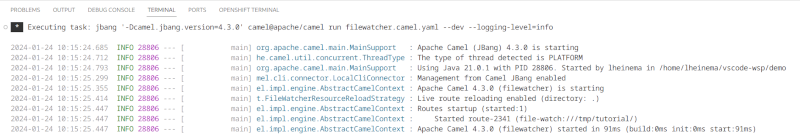

## 1 - Log changes

The goals for this exercise are:

 - Create a new Camel route and let it start with a `file-watch` step, which will watch a local folder like `/tmp/tutorial/` and configure the parameter `recursive` as `false`, because we don't want to watch subfolders
 - Then `log` the detected change with an output like `Detected  ${header.CamelFileEventType} on file ${header.CamelFileName} at ${header.CamelFileLastModified}`
 
### Hints
Helpful advice for doing things better or more easily.
- To add new, delete or replace steps on the canvas, right click an existing node. This will provide you a contextual menu.
- To configure a step and fill the configuration properties, click on the step icon in the canvas.
- The first step you want to add is called `file-watch`. Don't confuse it with `file`
- The second step is a `log` processor. There is also a `log` component available, but we use the processor here.

### Solution

The following video showcases the solution.



At this point, the source editor should show something similar to the following code:

```yaml
- route:
    id: route-2341
    from:
      id: from-2542
      uri: file-watch
      parameters:
        path: /tmp/tutorial/
        recursive: false
      steps:
        - log:
            id: log-4286
            message: Detected  ${header.CamelFileEventType} on file ${header.CamelFileName}
              at ${header.CamelFileLastModified}
```

If it doesn't look like that but you still want to go to the following exercise, you can copy and paste that code to your source editor and save the changes. This will update the design editor as well.

---

## 2 - Add a filter

Now we want to add a `filter` and a `file` between the `file-watch` and the `log`, which copies the files to another folder everytime a file gets created.

This will require adding two steps:
 - A step `filter` that will open a branch of steps that will be executed only when `${header.CamelFileEventType}` equals `CREATE`
 - A step `file` to create the new file in `/tmp/backup/` or whatever folder you choose (different from the previous one)

### Hints

 - To create a new file, you have to use the step `file`. Make sure to add it `into` the `filter` step.
 - Configure the `directory name` of the `file` step as `/tmp/backup/` (or whatever folder you are using)
 - The condition of the filter is configured in the filter expression field as `${header.CamelFileEventType} == 'CREATE'` using the `simple` expression language.

### Solution

The following video showcases the solution.



At this point, the source editor should show something similar to the following code:

```yaml
- route:
    id: route-2341
    from:
      id: from-2542
      uri: file-watch
      parameters:
        path: /tmp/tutorial/
        recursive: false
      steps:
        - filter:
            id: filter-1643
            steps:
              - to:
                  id: to-2886
                  uri: file
                  parameters:
                    directoryName: /tmp/backup/
            expression:
              simple:
                expression: ${header.CamelFileEventType} == 'CREATE'
        - log:
            id: log-4286
            message: Detected  ${header.CamelFileEventType} on file ${header.CamelFileName}
              at ${header.CamelFileLastModified}
```

If it doesn't look like that but you want to go to the following exercise, you can copy and paste that code to the source editor and save the changes. This will update the design editor as well.

---

## 3 - Testing your route

So after we finished setting up our little Camel route it would be great if we could test it locally, right? Ok, then let's do that now!

Maybe you already discovered the little buttons on the top right of the Kaoto editor. You can hover over them to know more about what they are doing. In the picture below the launch button has been marked with red coloring.


Click this button now and watch what happens. If everything goes well you should see a similar output as in the image below.



If you see something different and maybe errors, please check the `Hints` section below.

### Hints
- Please make sure that you have saved your route before running it.
- Make sure you installed the [Extension Pack for Apache Camel](https://marketplace.visualstudio.com/items?itemName=redhat.apache-camel-extension-pack) as this will add buttons for easy access to launch / debug functionality. Also ensure you have installed [Camel JBang](https://camel.apache.org/manual/camel-jbang.html), otherwise the launch will throw errors. (see [Installation Guide](/docs/installation))
- Make sure your folder (`/tmp/tutorial/`) exists before running this integration.
- This integration will work better when running it locally, as the folder must be on the same machine when it gets executed.

### Solution

The following video showcases the solution.



---

## More information

More information about Apache Camel routes can be found on [the Apache Camel website](https://camel.apache.org/components/4.0.x/others/yaml-dsl.html)
