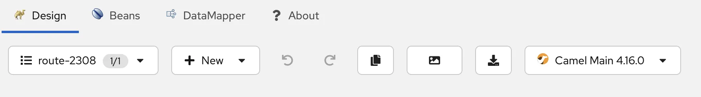
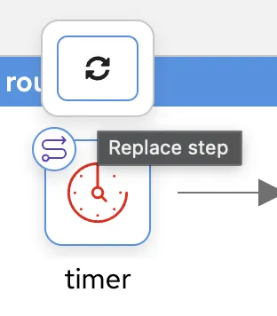
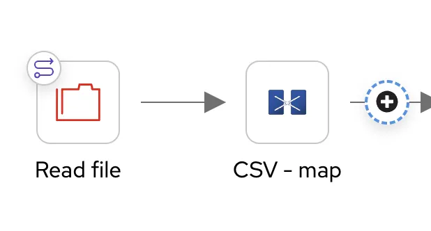
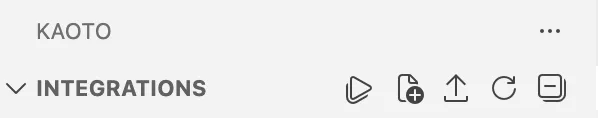
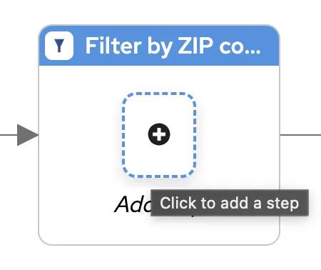
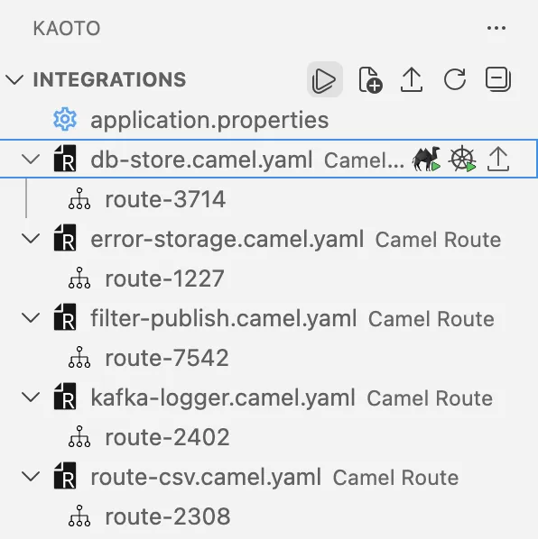
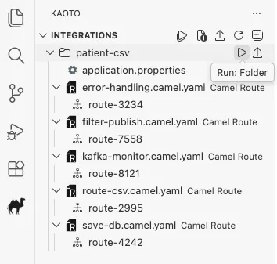

## Introduction

In this hands-on workshop, you will build a complete data processing pipeline using **Kaoto's visual designer** and **Apache Camel**. You'll work with real healthcare data from the Synthea patient dataset [^1] and learn how to combine multiple **Enterprise Integration Patterns (EIPs)** to create a robust CSV processing system.

**What You'll Learn:**
- File polling and CSV data ingestion
- Content-based routing and data validation
- Database integration with Postgres
- Message publishing with Apache Kafka
- Error handling and data quality management

**What You'll Build:**
A five-route integration pipeline that reads patient data from a CSV file, validates records, stores valid data in a database, publishes to Kafka for monitoring, and captures invalid records for review.

## Prerequisites

Before starting this workshop, ensure you have the following installed and configured on your system:

### Required Software

- **Visual Studio Code** - Download from [code.visualstudio.com](https://code.visualstudio.com/)
- **Kaoto Extension for VSCode** - Install from the [VSCode Marketplace](https://kaoto.io/docs/installation/)
- **Podman Desktop** or **Docker Desktop** - For running containerized services
  - Podman: [podman.io/docs/installation](https://podman.io/docs/installation), first step needs an additional step after installing found in this [link](https://camel.apache.org/manual/test-infra.html#_container_runtime_support) 
  - Docker: [docs.docker.com/get-docker](https://docs.docker.com/get-docker/)
- **Java Development Kit (JDK) 17 or later** - Required for running Apache Camel
  - Download from [Adoptium](https://adoptium.net/) or your preferred JDK distribution
- **Apache Camel JBang** (Optional but recommended) - For easy infrastructure setup
  - Install via: `curl -Ls https://sh.jbang.dev | bash -s - trust add https://github.com/apache/camel`
  - Then: `jbang app install camel@apache/camel`
- **Database Manager** (Optional but recommended) - For viewing and managing Postgres data
  - [DBeaver Community Edition](https://dbeaver.io/download/) - Free, cross-platform database tool
  - Alternatives: pgAdmin, DataGrip, or psql command-line tool

### Required Knowledge

This workshop assumes you have:

- **Basic understanding of integration concepts** - Familiarity with data processing pipelines
- **Basic command-line skills** - Ability to navigate directories and run commands
- **Basic understanding of CSV files** - Knowledge of comma-separated value format
- **Familiarity with VSCode** - Basic navigation and file management

### What You'll Set Up During the Workshop

The following will be configured as part of the workshop steps:

- Postgres database (via container)
- Apache Kafka (via container)
- Sample patient dataset (CSV file)
- Camel integration routes

> [!TIP]
> If you're new to Kaoto or Apache Camel, consider reviewing the [Kaoto documentation](https://kaoto.io/docs/).

## Project Setup

1. Install the [Kaoto extension for VSCode](https://kaoto.io/docs/installation/) and [Podman Desktop](https://podman.io/docs/installation).
2. Create a new directory for the workshop:

```bash
$ mkdir patient-csv
```

3. Download the dataset from the [Maven Analytics Data Playground](https://mavenanalytics.io/data-playground/hospital-patient-records).
4. Create the following directory structure:

```
patient-csv/
├── test-file/              # Place patients.csv here
│   └── patients.csv        # Your downloaded CSV file
├── errors/                 # Will be auto-created later
└── application.properties  # Will be created later
```

## Description

This workshop guides you through building a complete data processing pipeline using **Apache Camel** and **Kaoto**. You will create **five interconnected routes** that work together to process patient data from a CSV file. The pipeline demonstrates key **EIPs** including file polling, content-based routing, data transformation, and message publishing.

**The Five Routes:**

1. **Route 1: CSV Ingestion** - Reads and splits the CSV file into individual patient records
2. **Route 2: Data Filtering** - Validates records and routes them based on data quality
3. **Route 3: Database Storage** - Persists valid records to Postgres
4. **Route 4: Error Handling** - Captures invalid records for review and correction
5. **Route 5: Kafka Monitoring** - Publishes valid records to Kafka for real-time monitoring

**Data Flow Diagram:**

```
CSV File → Read & Split → Filter by ZIP code
                              ├─ Valid → Database + Kafka
                              └─ Invalid → Error Files
```

Each section below walks you through configuring one route, building toward a complete end-to-end integration.

## Route 1: CSV Ingestion and Archiving

### Goal

This route reads the source CSV file and splits it into individual patient records for downstream processing. Once the records are forwarded, the original file is moved to a "done" directory to prevent reprocessing.

### Step-by-Step Instructions

#### Step 1: Create a New Route

1. In VSCode, look for the **Kaoto** icon in the left sidebar and click it
2. Click the **Camel File...** button


3. If the previous **Camel File...** button is not showing, click on the second icon next to **Integrations** (a file with a + sign).

4. In the dialog that appears:
   - Select **Camel Route** as the file type
   - Select **YAML** as the Camel DSL
   - Choose `patient-csv` as the saving folder
   - Name the file `route-csv`

A new route will appear in the Kaoto visual designer with a default timer component.

5. Select Camel Main 4.16.0 from the options that appear when clicking the Camel version. Other options present some variations related to the versions releases that may differ in some of the components presentation.



#### Step 2: Configure the File Reader Component

The first component needs to read files from the `test-file` directory.

1. **Hover** over the first component (timer) in the visual designer
2. Click the **Replace** icon (circular arrow) that appears



3. In the search box, type `file` and select the **File** component
4. Click on the File component to open its properties panel on the right
5. Navigate to the **All** tab at the top of the properties panel
6. Configure the following properties:

   | Property | Value | What it does |
   |----------|-------|--------------|
   | **directoryName** | `./test-file` | Specifies which folder to monitor |
   | **description** | `Read file` | Adds a human-readable label |
   | **idempotent** | `true` | Prevents processing the same file twice |
   | **idempotentKey** | `${file:name}` | Uses filename as unique identifier |
   | **move** | `done` | Moves processed files to a "done" subfolder |

7. **Save** with the keyboard command `CTRL/CMD` + `S` or click in **File** (VS Code menu bar top left) and click on **Save**

> [!TIP]
> Always Save after configuring each component to preserve your changes.


#### Step 3: Add CSV Parsing (Unmarshal)

Now we need to parse the CSV content into a structured format.

1. **Hover** over the second component (SetBody) in the route
2. Click the **Replace** icon
3. Search for `unmarshal` and select the **Unmarshal** processor
4. Click on the Unmarshal component to open its properties
5. Navigate to the **All** tab
6. Configure the following:

   | Property | Value | What it does |
   |----------|-------|--------------|
   | **description** | `CSV - map` | Adds a human-readable label |
   | **Data Format Type** | `CSV` | Handles CSV payloads |
   | **header** | `Id,BIRTHDATE,DEATHDATE,PREFIX,FIRST,LAST,SUFFIX,MAIDEN,MARITAL,RACE,ETHNICITY,GENDER,BIRTHPLACE,ADDRESS,CITY,STATE,COUNTY,ZIP,LAT,LON` | Defines CSV column names |
   | **trim** | `true` | Removes whitespace from values |
   | **useMaps** | `true` | Converts each row to a map/dictionary |

> [!NOTE]
> The header value should be copied from the first line of your `patients.csv` file. This tells Camel what each column represents.

7. **Save** the changes

#### Step 4: Split Records

We need to split the CSV data into individual patient records.

1. **Hover** over the arrow after the Unmarshal component
2. Click the **+** icon that appears on the arrow



3. Search for `split` and select the **Split** processor
4. Click on the Split component to open its properties
5. Navigate to the **Required** tab
6. Configure:
   - **Language**: Select **CSimple** from the dropdown
   - **Expression**: Enter `${body}`

7. Navigate to the **All** tab
8. Add:
   - **description**: `Split by patient`

9. **Save** the changes

> **💡 What's happening:** The Split processor takes the list of all patient records and processes each one individually through the rest of the pipeline.

#### Step 5: Send to Next Route

Finally, we need to send each patient record to the next route for filtering.

1. **Hover** over the last component in the route (Logger)
2. Click the **Replace** icon
3. Search for `direct` and select the **Direct** component
4. Click on the Direct component to open its properties
5. Navigate to the **Required** tab
6. Set **name** to: `From Read CSV`

7. **Save** the changes

> **💡 What is Direct?** The Direct component is like a named pipe that connects routes together. The name `From Read CSV` will be used by the next route to receive data from this route.

#### Step 6: Review Your Route

Your completed route should look like this in the visual designer:


- route:
    id: route-2308
    from:
      id: from-1527
      description: Read file
      uri: file
      parameters:
        directoryName: ./test-file
        idempotent: true
        idempotentKey: ${file:name}
        move: done
      steps:
        - unmarshal:
            id: unmarshal-3798
            description: CSV - map
            csv:
              header: Id,BIRTHDATE,DEATHDATE,PREFIX,FIRST,LAST,SUFFIX,MAIDEN,MARITAL,RACE,ETHNICITY,GENDER,BIRTHPLACE,ADDRESS,CITY,STATE,COUNTY,ZIP,LAT,LON
              trim: true
              useMaps: true
        - split:
            id: split-2544
            description: Split by patient
            csimple:
              expression: ${body}
        - to:
            id: to-1297
            uri: direct
            parameters:
              name: From Read CSV


**✅ Checkpoint:** You've completed Route 1! This route will read the CSV file, parse it, split it into individual records, and send each record to the next route.

## Route 2: Data Filtering and Routing

### Goal

This route validates patient records by checking if they have a ZIP code. Valid records (with ZIP code) are sent to both the database and Kafka. Invalid records (missing ZIP code) are sent to error handling.

### Step-by-Step Instructions

#### Step 1: Create a New Route

1. This step follows the same process as in the previous route (**Route 1: CSV Ingestion and Archiving**) step 1
2. Name the new route `filter-publish`



#### Step 2: Configure the Direct Receiver

This route receives data from Route 1 through the Direct component.

1. **Replace** the first component (timer) with a **Direct** component
2. In the **Required** tab, set:
   - **name**: `From Read CSV` (must match the name from Route 1!)
3. In the **All** tab, set:
   - **description**: `Receiving from CSV route`
4. **Save** the changes

> [!IMPORTANT]
> The Direct name must exactly match the one used in Route 1 for the routes to connect properly.

#### Step 3: Add Filter for Data Validation

Now we'll add logic to check if the ZIP code is present.

1. **Replace** the second component with a **Filter** processor
2. In the **All** tab, configure:

   | Property | Value | What it does |
   |----------|-------|--------------|
   | **description** | `Filter by ZIP code` | Adds a human-readable label |
   | **Expression language** | **Simple** | The language for the filter expression |
   | **Expression** | `${body[ZIP]} == null \|\| ${body[ZIP]} == ""` | Checks if ZIP is missing or empty |

3. **Save** the changes

> **💡 Understanding the Filter:** This expression returns `true` for invalid records (missing ZIP), which will be processed inside the filter. Valid records will skip the filter and continue to the next step.

#### Step 4: Handle Invalid Records (Inside Filter)

Click **inside the filter placeholder** (the dotted box) to add components that handle invalid records.



1. Add a **Direct** component:
   - **name**: `Send-To-Error`
   - **description**: `Sending error`
   
2. Add a **Stop** processor after the Direct component
   - This stops processing for invalid records after sending them to error handling

3. **Save** the changes

> **💡 What's happening:** Invalid records are sent to the error handling route and then stopped. They won't continue to the database or Kafka.

#### Step 5: Add Multicast for Valid Records

After the filter (outside of it), we need to send valid records to multiple destinations.

1. Replace the last component (log, after the filter) with a **Multicast** processor
2. In the **All** tab, set:
   - **description**: `Multicast Not Null Data`
3. **Save** the changes

> **💡 What is Multicast?** Multicast sends the same message to multiple destinations simultaneously. We'll use it to send valid records to both the database and Kafka.

#### Step 6: Configure Database Destination

Click **inside the multicast** to add the first destination.

1. Add a **Direct** component:
   - **name**: `Send-To-DB`
   - **description**: `Sending to DB`
2. **Save** the changes

#### Step 7: Configure Kafka Destination

Still inside the multicast, add the second destination.

1. Add a **Kafka** component
2. In the **All** tab, configure:

   | Property | Value | What it does |
   |----------|-------|--------------|
   | **description** | `Sent by Kafka` | Adds a human-readable label |
   | **brokers** | `{{csv-processor.kafka.brokers}}` | Kafka server address (from properties file) |
   | **topic** | `Kafka-Message` | The Kafka topic name |

3. **Save** the changes

#### Step 8: Create Application Properties File

The Kafka component references a property placeholder. Let's create the configuration file.

1. Add the following content in `application.properties` file (created in the project setup):

```properties
# Kafka Configuration
csv-processor.kafka.brokers = localhost:9092
```

2. **Save** the file

#### Step 9: Set Up Kafka (Choose One Option)

Before running the pipeline, you need a Kafka instance. Choose one of these options:

**Option A: Using [Camel Infra](https://camel.apache.org/manual/camel-jbang.html#_infrastructure) (Recommended for beginners)**

1. **Start your container runtime:**
   - Open **Podman Desktop** or **Docker Desktop**

2. **Open a terminal in VSCode**

3. **Run the Camel Infra command:**
   ```bash
   $ camel infra run kafka
   ```

4. **Wait for Kafka to start:**
   - You'll see log messages indicating Kafka is starting
   - The terminal will continue running - this is normal, keep it open

> **💡 What does this do?** Camel Infra automatically downloads and starts a Kafka container with sensible defaults, perfect for development and testing.

**Option B: Using Podman/Docker Compose**

1. **Get a compose file:**
   - Visit the [Kaoto examples repository](https://github.com/KaotoIO/kaoto-examples/blob/main/csv-processor/kafka-postgres.compose.yaml)
   - Download the Kafka compose file from the examples

2. **Start Kafka:**

```bash
   $ podman-compose -f kafka-postgres.compose.yaml up -d
   # or
   $ docker-compose -f kafka-postgres.compose.yaml up -d
```

3. **Verify Kafka is running:**

```bash
   $ podman ps
   # or
   $ docker ps
```
   You should see Kafka container running.

#### Step 10: Review Your Route

Your completed route should look like this:


- route:
    id: route-7542
    from:
      id: from-3743
      uri: direct
      parameters:
        name: From Read CSV
      steps:
        - filter:
            id: filter-3679
            description: Filter by ZIP code
            steps:
              - to:
                  id: to-1377
                  description: Sending error
                  uri: direct
                  parameters:
                    name: Send-To-Error
              - stop:
                  id: stop-3684
            simple:
              expression: ${body[ZIP]} == null || ${body[ZIP]} == ""
        - multicast:
            id: multicast-7959
            description: Multicast Not Null Data
            steps:
              - to:
                  id: to-3009
                  description: Sending to DB
                  uri: direct
                  parameters:
                    name: Send-To-DB
              - to:
                  id: to-2812
                  description: Sent by Kafka
                  uri: kafka
                  parameters:
                    brokers: "{{csv-processor.kafka.brokers}}"
                    topic: Kafka-Message
``

**✅ Checkpoint:** You've completed Route 2! This route validates records and routes them to the appropriate destinations based on data quality.

## Route 3: Database Storage

### Goal

This route receives valid patient records and stores them in a Postgres database for long-term persistence and analytics.

### Step-by-Step Instructions

#### Step 1: Set Up Postgres (Choose One Option)

Before creating the route, you need a Postgres instance. Follow the same option, A or B, chosen in the previous route when configuring Kafka.

**Option A: Using [Camel Infra](https://camel.apache.org/manual/camel-jbang.html#_infrastructure) (Recommended for beginners)**

1. **Ensure your container runtime is running:**
   - Open **Podman Desktop** or **Docker Desktop** if not already running

2. **Open a new terminal in VSCode**

3. **Run the Camel Infra command:**
   
```bash
   $ camel infra run postgres
```

4. **Wait for Postgres to start:**
   - You'll see log messages indicating Postgres is starting

5. **Note the default credentials:**
   - Username: `test`
   - Password: `test`
   - Database: `test`
   - Port: `5432`

> **💡 What does this do?** Camel Infra automatically downloads and starts a Postgres container with default credentials, perfect for development and testing.

**Option B: Using Podman/Docker Compose**

1. **Verify Postgres is running:**

```bash
   $ podman ps
   # or
   $ docker ps
```

   You should see a Postgres container running.

#### Step 2: Update Application Properties

Add Postgres configuration to your `application.properties` file:

```properties
# Postgres Configuration
csv-processor.postgres.server-name = localhost
csv-processor.postgres.username = test
csv-processor.postgres.password = test
csv-processor.postgres.database-name = test
```

**Save** the file.

#### Step 3: Create Database Table

Now you need to connect to your Postgres instance and create the patients table.

**Connect to Postgres:**

Choose one of these methods to connect:

**Option A: Using DBeaver (Recommended if installed)**

1. Open **DBeaver**
2. Click **Database** → **New Database Connection**
3. Select **PostgreSQL** and click **Next**
4. Enter the connection details:
   - **Host**: `localhost`
   - **Port**: `5432`
   - **Database**: `test`
   - **Username**: `test`
   - **Password**: `test`
5. Click **Test Connection** to verify
6. Click **Finish**

**Option B: Using psql command line**

Open a new terminal and run:

```bash
  $ psql -h localhost -U test -d test
  # When prompted, enter password: test
```

**Option C: Using pgAdmin or other database tools**

Use the same connection details as Option A above.

**Create the table:**

Once connected, execute this SQL statement:

```sql
CREATE TABLE patients (
    id character(64) NOT NULL,
    birthdate character(10),
    ZIP character(5)
);
```

> [!NOTE]
> This simplified table includes only three fields for the workshop. In a real application, you'd include all patient fields.

**Verify the table was created:**

Run this query to confirm:

```sql
SELECT * FROM patients LIMIT 1;
```

You should see an empty result set with the three column headers (id, birthdate, ZIP).

#### Step 4: Create a New Route

1. This step follows the same process as in the **Route 1: CSV Ingestion and Archiving** step 1
2. Name the route `save-db`

#### Step 5: Configure the Direct Receiver

1. **Replace** the first component with a **Direct** component
2. In the **Required** tab, set:
   - **name**: `Send-To-DB` (must match Route 2!)
3. In the **All** tab, set:
   - **description**: `Receiving for DB`
4. **Save** the changes

#### Step 6: Add JSON Marshaller

The PostgreSQL Kamelet expects JSON input, so we need to convert the data.

1. Replace the second component (SetBody) with a **Marshal** processor
2. In the **Required** tab:
   - Select **JSON** as the format
3. In the **All** tab:
   - **description**: `Convert to JSON`
4. **Save** the changes

> **💡 What is Marshal?** Marshal converts data from one format to another. Here, we're converting the map structure to JSON format.

#### Step 7: Add PostgreSQL Sink

Now we'll add the component that actually writes to the database.

1. Replace the last component (Logger) with a **PostgreSQL Sink** Kamelet (search for "postgresql sink")
2. In the **All** tab, configure:

   | Property | Value | What it does |
   |----------|-------|--------------|
   | **description** | `Save in Postgres` | Adds a human-readable label |
   | **databaseName** | `{{csv-processor.postgres.database-name}}` | Database name from properties |
   | **password** | `{{csv-processor.postgres.password}}` | Database password from properties |
   | **serverName** | `{{csv-processor.postgres.server-name}}` | Database server address from properties |
   | **username** | `{{csv-processor.postgres.username}}` | Database username from properties |
   | **query** | `INSERT INTO patients (id, birthdate, ZIP) VALUES (:#${body[Id]}, :#${body[BIRTHDATE]}, :#${body[ZIP]});` | SQL insert statement |

3. **Save** the changes

> **💡 Understanding the Query:** The `:#${...}` syntax safely inserts values from the message body into the SQL query, preventing SQL injection attacks.

#### Step 8: Review Your Route

Your completed route should look like this:


- route:
    id: route-3714
    from:
      id: from-4191
      description: Receiving for DB
      uri: direct
      parameters:
        name: Send-To-DB
      steps:
        - marshal:
            id: marshal-6992
            description: Convert to JSON
            json: {}
        - to:
            id: to-3764
            description: Save in Postgres
            uri: kamelet:postgresql-sink
            parameters:
              databaseName: "{{csv-processor.postgres.database-name}}"
              password: "{{csv-processor.postgres.password}}"
              query: INSERT INTO patients (id, birthdate, ZIP) VALUES (:#${body[Id]},
                :#${body[BIRTHDATE]}, :#${body[ZIP]});
              serverName: "{{csv-processor.postgres.server-name}}"
              username: "{{csv-processor.postgres.username}}"


**✅ Checkpoint:** You've completed Route 3! This route will store all valid patient records in the Postgres database.

## Route 4: Error Handling

### Goal

This route captures invalid patient records (those missing ZIP codes) and writes them to error files for later review and correction.

### Step-by-Step Instructions

#### Step 1: Create a New Route

1. This step follows the same process as in the **Route 1: CSV Ingestion and Archiving** step 1
2. Name the route `error-handling`

#### Step 2: Configure the Direct Receiver

1. **Replace** the first component with a **Direct** component
2. In the **Required** tab, set:
   - **name**: `Send-To-Error` (must match Route 2!)
3. In the **All** tab, set:
   - **description**: `Receiving error`
4. **Save** the changes

#### Step 3: Add CSV Marshaller

We need to convert the data back to CSV format for the error file.

1. Replace the second component (SetBody) with a **Marshal** processor
2. In the **Required** tab:
   - Select **CSV** as the format
3. In the **All** tab, configure:

   | Property | Value | What it does |
   |----------|-------|--------------|
   | **description** | `Convert to CSV` | Adds a human-readable label |
   | **header** | `Id,BIRTHDATE,DEATHDATE,PREFIX,FIRST,LAST,SUFFIX,MAIDEN,MARITAL,RACE,ETHNICITY,GENDER,BIRTHPLACE,ADDRESS,CITY,STATE,COUNTY,ZIP,LAT,LON` | CSV column headers |

4. **Save** the changes

> [!IMPORTANT]
> Use the same header as in Route 1 to maintain consistency with the original CSV format.

#### Step 4: Add File Writer

Now we'll write the error records to files.

1. Replace the last component (Logger) with a **File** component
2. In the **All** tab, configure:

   | Property | Value | What it does |
   |----------|-------|--------------|
   | **description** | `Create Error Files` | Adds a human-readable label |
   | **directoryName** | `./errors` | Directory for error files |
   | **fileName** | `${date:now:yyyyMMddHHmmss}_${exchangeId}.csv` | Unique filename with timestamp |

3. **Save** the changes

> **💡 Understanding the Filename:** 
> - `${date:now:yyyyMMddHHmmss}` creates a timestamp (e.g., 20260127143000)
> - `${exchangeId}` adds a unique identifier for each message
> - This ensures each error file has a unique name and won't overwrite others while providing traceability

#### Step 5: Review Your Route

Your completed route should look like this:


- route:
    id: route-1227
    from:
      id: from-1382
      description: Receiving error
      uri: direct
      parameters:
        name: Send-To-Error
      steps:
        - marshal:
            id: marshal-1879
            description: Convert to CSV
            csv:
              header: Id,BIRTHDATE,DEATHDATE,PREFIX,FIRST,LAST,SUFFIX,MAIDEN,MARITAL,RACE,ETHNICITY,GENDER,BIRTHPLACE,ADDRESS,CITY,STATE,COUNTY,ZIP,LAT,LON
        - to:
            id: to-1767
            description: Create Error Files
            uri: file
            parameters:
              directoryName: ./errors
              fileName: ${date:now:yyyyMMddHHmmss}_${exchangeId}.csv


**✅ Checkpoint:** You've completed Route 4! This route will capture all invalid records and save them to timestamped error files for review.

## Route 5: Kafka Monitoring

### Goal

This route demonstrates real-time monitoring by consuming messages from Kafka and logging them to the console. This provides visibility into the data flowing through your pipeline.

### Step-by-Step Instructions

#### Step 1: Create a New Route

1. This step follows the same process as in the **Route 1: CSV Ingestion and Archiving** step 1
2. Name the route `kafka-monitor`

#### Step 2: Configure Kafka Consumer

1. **Replace** the first component with a **Kafka** component
2. In the **All** tab, configure:

   | Property | Value | What it does |
   |----------|-------|--------------|
   | **description** | `Receiver Kafka` | Adds a human-readable label |
   | **brokers** | `{{csv-processor.kafka.brokers}}` | Kafka server address from properties |
   | **topic** | `Kafka-Message` | The topic to consume from (matches Route 2) |
   | **autoOffsetReset** | `earliest` | Start reading from the beginning of the topic |

3. **Save** the changes

> **💡 What is autoOffsetReset?** Setting this to `earliest` means the consumer will read all messages from the beginning of the topic, even those published before the consumer started. This is useful for testing and ensures you don't miss any data.

#### Step 3: Add Log Data component

1. Replace the second component with a **Log data** component
2. In the **Required** tab, set:
   - **name**: `InfoLogger`
3. **Save** the changes

> **💡 What does this do?** This component logs basic information about each message, including headers and metadata.

#### Step 4: Add Logger EIP

1. Leave the **Logger** processor (note: this is different from the **Log data** component)
2. In the **All** tab, configure:

   | Property | Value | What it does |
   |----------|-------|--------------|
   | **description** | `Logger` | Adds a human-readable label |
   | **message** | `${body} For Kafka` | Custom message to log |

3. **Save** the changes

> **💡 Understanding the Message:** The `${body}` expression will be replaced with the actual message content, followed by the text "For Kafka". This helps you see what data is flowing through the pipeline.

#### Step 5: Review Your Route

Your completed route should look like this:


- route:
    id: route-2402
    from:
      id: from-2667
      description: Receiver Kafka
      uri: kafka
      parameters:
        autoOffsetReset: earliest
        brokers: "{{csv-processor.kafka.brokers}}"
        topic: Kafka-Message
      steps:
        - to:
            id: to-4131
            uri: log:InfoLogger
            parameters: {}
        - log:
            description: Logger
            message: ${body} For Kafka


**✅ Checkpoint:** You've completed Route 5! This route will consume messages from Kafka and display them in the console for monitoring.

## Running the Complete Pipeline

Congratulations! You've built all five routes. Now it's time to run the complete pipeline and see it in action.

### Prerequisites Check

Before running, ensure:

- ✅ All five routes are created and saved
- ✅ `application.properties` file exists with correct configuration
- ✅ `patients.csv` file is in the `test-file/` directory
- ✅ Postgres is running (via Podman / Docker)
- ✅ Kafka is running (via Podman / Docker)
- ✅ Database table `patients` has been created

### How to Run

1. In the VSCode file explorer, locate your `patient-csv` folder
2. In the Kaoto extension panel, find the folder containing all your YAML route files
3. Click the **Play** button (▶️) next to Integrations or next to the folder name




> **💡 Why run from the folder?** Running all routes together ensures they execute within the same **Camel context**, allowing them to communicate through the Direct endpoints.

### What to Expect

When you run the pipeline, you should see:

1. **Console output** showing:
   - Files being read from `test-file/`
   - Records being processed
   - Kafka messages being consumed and logged
   - Any errors or warnings

2. **File system changes**:
   - Original `patients.csv` moved to `test-file/done/`
   - Error files created in `errors/` (if any invalid records exist)

3. **Database updates**:
   - Valid records inserted into Postgres

### Monitoring the Pipeline

Watch the VSCode terminal for log messages. You should see output similar to:

```
INFO  [route-2308] Read file: patients.csv
INFO  [route-7542] Filtering records...
INFO  [route-3714] Saving to database...
INFO  [route-2402] {Id=123, BIRTHDATE=1990-01-01, ZIP=12345} For Kafka
```

## Verifying Results

After the pipeline completes, verify that everything worked correctly.

### 1. Check File Archiving

**What to verify:** The original CSV file should be moved to the done directory.

**How to check:**

1. Navigate to `patient-csv/test-file/done/`
2. Confirm `patients.csv` is present
3. Verify `patient-csv/test-file/` is now empty (except for the done folder)

**Expected result:** ✅ File successfully archived

### 2. Check Database Persistence

**What to verify:** Valid records should be stored in Postgres.

**How to check:**

Connect to your Postgres database and run:

```sql
SELECT COUNT(*) FROM patients;
```

You should see a count of all valid records (those with ZIP codes).

**To see sample data:**

```sql
SELECT * FROM patients LIMIT 10;
```

**Expected result:** ✅ Records present in database with id, birthdate, and ZIP values

### 3. Check Error Handling

**What to verify:** Invalid records should be written to error files.

**How to check:**

1. Navigate to `patient-csv/errors/`
2. Look for CSV files with timestamps in their names (e.g., `20260127143000_ABC123.csv`)
3. Open one of the error files to verify it contains records with missing ZIP codes

**Expected result:** ✅ Error files created (if invalid records exist in your dataset)

> [!NOTE]
> If your custom dataset (different from the recommended for this workshop) has no records with missing ZIP codes, the errors directory will remain empty. This is normal!

### 4. Check Kafka Monitoring

**What to verify:** Valid records should be published to Kafka and logged.

**How to check:**

1. Look at the VSCode terminal output
2. Search for log messages containing "For Kafka"
3. Verify you see patient record data in the logs

**Expected result:** ✅ Console shows messages like `{Id=123, BIRTHDATE=1990-01-01, ZIP=12345} For Kafka`

### Expected Pipeline Behavior Summary

| Data Type | Processing Path | Result |
|-----------|----------------|--------|
| **Valid records** (with ZIP code) | Route 1 → Route 2 → Route 3 + Route 5 | Stored in Postgres AND published to Kafka |
| **Invalid records** (missing ZIP code) | Route 1 → Route 2 → Route 4 | Written to timestamped error files |
| **Source file** | Route 1 | Moved to `test-file/done/` directory |

## Additional Resources

### Documentation

- [Kaoto Documentation](https://kaoto.io/docs/) - Kaoto user guide and tutorials
- [Apache Camel Documentation](https://camel.apache.org/docs/) - Complete Camel reference
- [Enterprise Integration Patterns](https://www.enterpriseintegrationpatterns.com/) - EIP reference

### Example Code

- [Kaoto Examples Repository](https://github.com/KaotoIO/kaoto-examples) - Complete working examples
- This workshop's complete code is available in the examples repository

### Community

- [Kaoto GitHub](https://github.com/KaotoIO/kaoto) - Report issues and contribute
- [Apache Camel Community](https://camel.apache.org/community/) - Get help and connect with other users

## References

[^1]: Jason Walonoski, Mark Kramer, Joseph Nichols, Andre Quina, Chris Moesel, Dylan Hall, Carlton Duffett, Kudakwashe Dube, Thomas Gallagher, Scott McLachlan, Synthea: An approach, method, and software mechanism for generating synthetic patients and the synthetic electronic health care record, **Journal of the American Medical Informatics Association**, 25(3), 230–238, 2018.